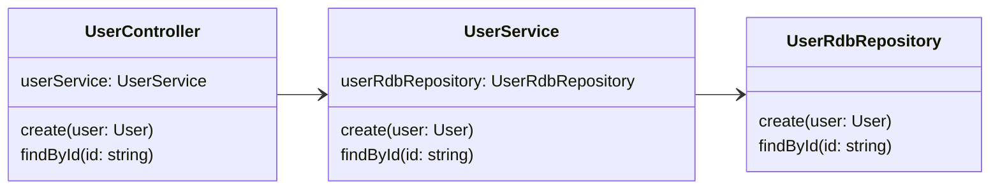
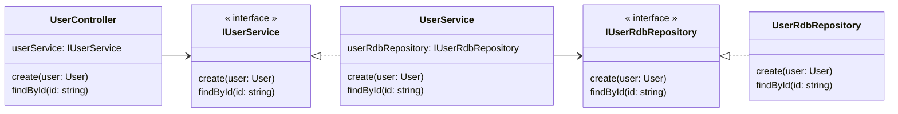
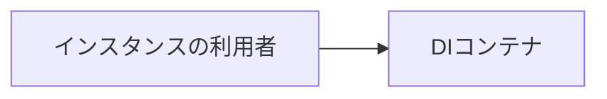

# 依存性逆転の原則

## 依存性逆転の原則とは

- 上位のモジュールは下位モジュールに依存してはならない。どちらもモジュール「抽象」に依存すべき
- 「抽象」は実装の詳細に依存してはならない。実装の詳細が「抽象」に依存すべきである

## 依存性逆転の原則に違反している例



## 依存性逆転の原則に違反するとどうなるか

- 下位モジュールの変更が上位モジュールに影響する
- 下位モジュールがないと上位モジュールが開発できない
- モジュールの拡張性・再利用性が低い
- 単体テストが困難

## 解決策



## 補足

### Dependency Injectionとは

クラス間の依存関係をソースコードから排除するために、コンストラクタやセッターメソッドを通じて外部からオブジェクトを渡せるようにするパターン

```ts
class UserService {
  private userRdbRepository = new userRdbRepository();
}
```

↓↓↓

```ts
class Userservice {
  parivate readonly userRepository: IUserRepository;
  constructor(userRepository: IUserRepository) {
    this.userRepository = userRepository;
  }
}
```

### DIのメリット
- クラス間の関連が弱まり、変更に強いプログラムになる
- 実装の詳細がなくても開発を進められる
- 本番用とテスト用など、クラスの切り替えが容易にできるようになり、テスタブルなプログラムになる。

### DIのデメリット
- 外部から渡すためのインスタンスの生成が大変
- DIコンテナを用いる場合、別途ライブラリが必要

### DIコンテナとは
自動でDIを行ってインスタンスを構築してくれる仕組み

- 例）注入するインスタンスの生成が大変
```
const sample = new Sample(new Hoge(new Fuga(), new Piyo()));
```

DIコンテナにクラスと生成方法を登録しておき、DIコンテナ経由でインスタンス化を行うことで、事前に登録しておいた状態でインスタンスを取得可能




## TypeScript

### 違反例


```ts
class User {}

class UserController {
  private userService = new UserService();

  create(user: User): User {
    return this.userService.create(user);
  }
  findById(id: string): User {
    return this.userService.findById(id);
  }
}

class UserService {
  private userRepository = new UserRdbRepository();

  create(user: User): User {
    return this.userRepository.create(user);
  }

  findById(id: string): User {
    return this.userRepository.findById(id);
  }
}

class UserRdbRepository {
  create(user: User) {
    console.log('RDBにUserを登録');
    return user;
  }
  findById(id: string) {
    console.log(`ID:${id}のユーザーを検索`);
    return new User();
  }
}

const run = () => {
  const userController = new UserController();
  userController.create(new User());
  userController.findById('123');
};

run();

```
##### 実行結果
```
RDBにUserを登録
id: 123でユーザーを検索
```

### 解決策


```ts
class User {}

class UserController {
  constructor(private userService: IUserService) {}
  create(user: User) {
    return this.userService.create(user);
  }
  findById(id: string) {
    return this.userService.findById(id);
  }
}

interface IUserService {
  create(user: User);
  findById(id: string);
}

class UserService implements IUserService {
  constructor(private userRdbRepository: IUserRdbRepository) {}
  create(user: User) {
    return this.userRdbRepository.create(user);
  }
  findById(id: string) {
    return this.userRdbRepository.findById(id);
  }
}
interface IUserRdbRepository {
  create(user: User);
  findById(id: string);
}

class UserRdbRepository implements IUserRdbRepository {
  create(user: User) {
    console.log('RDBにUserを登録');
    return user;
  }
  findById(id: string) {
    console.log(`id: ${id}でユーザーを検索`);
    return new User();
  }
}

const run = () => {
  const repository = new UserRdbRepository();
  const service = new UserService(repository);
  const userContorller = new UserController(service);
  userContorller.create(new User());
  userContorller.findById('123');
};

run();


```


##### 実行結果
```
RDBにUserを登録
id: 123でユーザーを検索
```


#### 変更
```ts
class User {}

class UserController {
  constructor(private userService: IUserService) {}
  create(user: User) {
    return this.userService.create(user);
  }
  findById(id: string) {
    return this.userService.findById(id);
  }
}

interface IUserService {
  create(user: User);
  findById(id: string);
}

class UserService implements IUserService {
  constructor(private userRdbRepository: IUserRdbRepository) {}
  create(user: User) {
    return this.userRdbRepository.create(user);
  }
  findById(id: string) {
    return this.userRdbRepository.findById(id);
  }
}
interface IUserRdbRepository {
  create(user: User);
  findById(id: string);
}

class UserRdbRepository implements IUserRdbRepository {
  create(user: User) {
    console.log('RDBにUserを登録');
    return user;
  }
  findById(id: string) {
    console.log(`id: ${id}でユーザーを検索`);
    return new User();
  }
}

class TestRdbRepository implements IUserRdbRepository {
  create(user: User) {
    console.log('Test RDBにUserを登録');
    return user;
  }
  findById(id: string) {
    console.log(`Test id: ${id}でユーザーを検索`);
    return new User();
  }
}

const run = () => {
  // const repository = new UserRdbRepository();
  const repository = new TestRdbRepository();
  const service = new UserService(repository);
  const userContorller = new UserController(service);
  userContorller.create(new User());
  userContorller.findById('123');
};

run();
```

##### 実行結果
```
Test RDBにUserを登録
Test id: 123でユーザーを検索
```