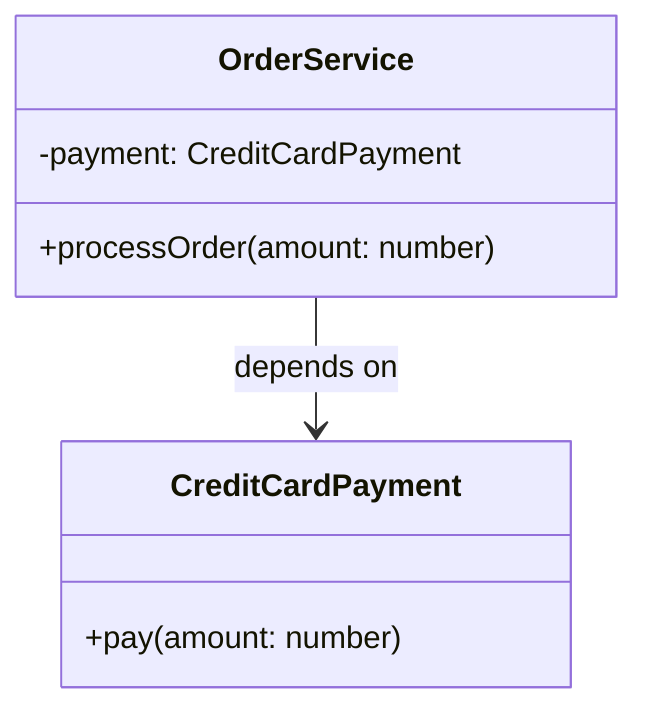
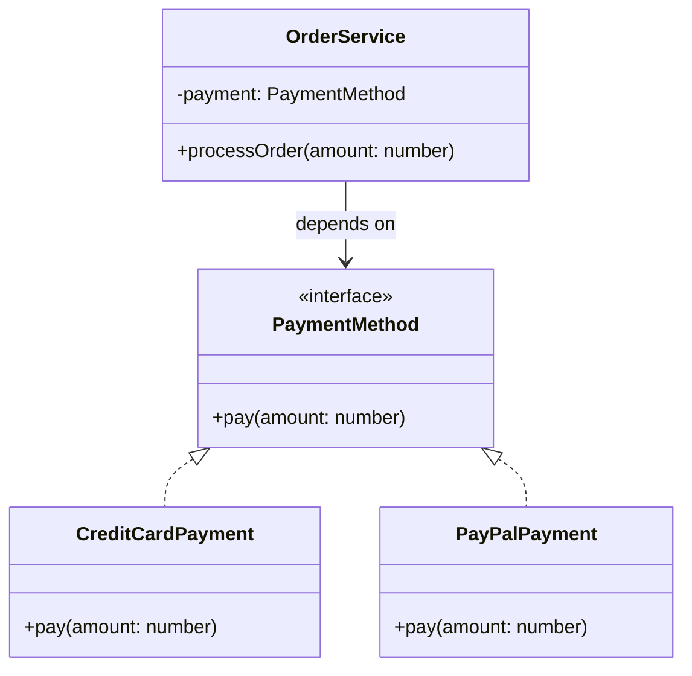
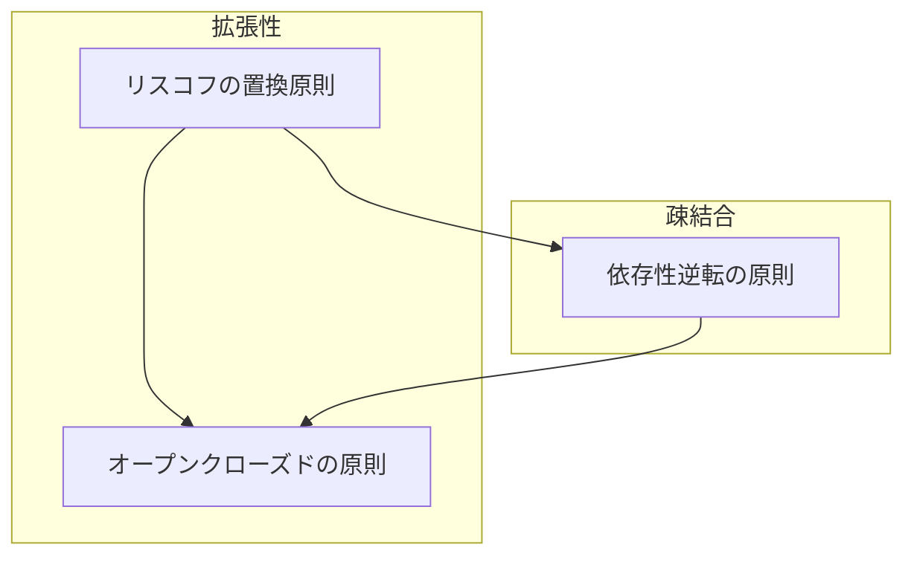

# 依存性逆転の原則 (Dependency Inversion Principle)

## 依存性逆転の原則とは

::: info DIPの2つの原則
- 上位のモジュールは下位モジュールに依存してはならない。どちらもモジュール「抽象」に依存すべき
- 「抽象」は実装の詳細に依存してはならない。実装の詳細が「抽象」に依存すべきである
:::

## 依存性逆転の原則に違反している例

たとえば、`OrderService` が `CreditCardPayment` に直接依存している場合を考えます。

#### クラス図



#### コード
```ts
class CreditCardPayment {
  pay(amount: number): void {
    console.log(`クレジットカードで${amount}円支払いました。`);
  }
}

class OrderService {
  private payment = new CreditCardPayment();

  processOrder(amount: number): void {
    this.payment.pay(amount);
  }
}
```


### ❌ 問題点

::: danger DIP違反の問題
- `OrderService` が `CreditCardPayment` に強く依存しており、他の支払い方法を使いたくなったときに書き換えが必要になる
- 単体テスト時に支払い部分を差し替えられない
:::

## 原則に違反するとどうなるか

```ts
class PayPalPayment {
  pay(amount: number): void {
    console.log(`PayPalで${amount}円支払いました。`);
  }
}

// OrderService 側で直接PayPalPaymentに書き換える必要がある
```

## 解決策：抽象に依存する


#### クラス図



#### コード
```ts
interface PaymentMethod {
  pay(amount: number): void;
}

class CreditCardPayment implements PaymentMethod {
  pay(amount: number): void {
    console.log(`クレジットカードで${amount}円支払いました。`);
  }
}

class PayPalPayment implements PaymentMethod {
  pay(amount: number): void {
    console.log(`PayPalで${amount}円支払いました。`);
  }
}

class OrderService {
  constructor(private payment: PaymentMethod) {}

  processOrder(amount: number): void {
    this.payment.pay(amount);
  }
}
```

### ✅ 利点

::: tip 抽象に依存するメリット
- `OrderService` は `PaymentMethod` という抽象に依存しているので、他の支払い手段を自由に差し替えられる
- テスト時には `MockPayment` を注入することで柔軟なテストが可能
:::

## 他のSOLID原則との関連

#### 関連図



- **オープンクローズドの原則** では、機能拡張時に既存コードを変更せずに済むことが重要ですが、DIPによって依存先を抽象化することで、その前提を作ることができます。
- **リスコフの置換原則** を満たしていることで、DIPで注入された具体クラスが安全に置き換え可能となり、システムの安定性が保たれます。