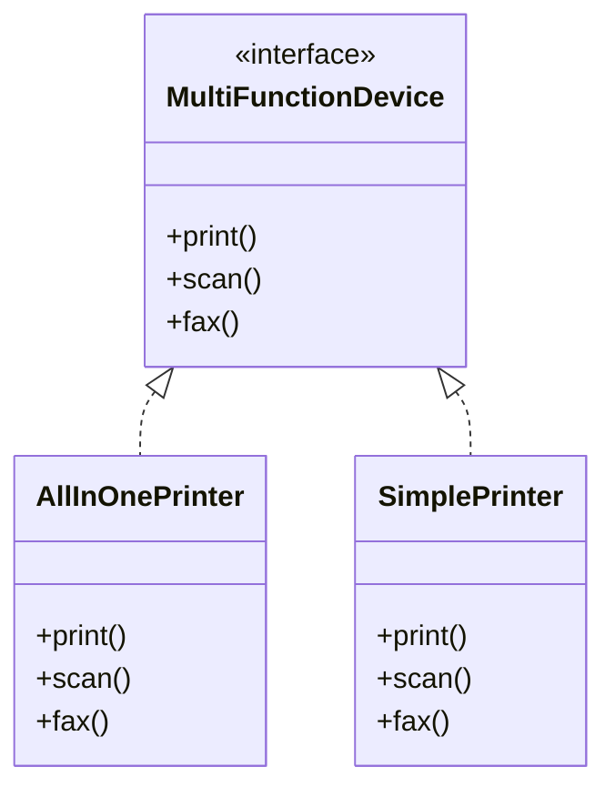
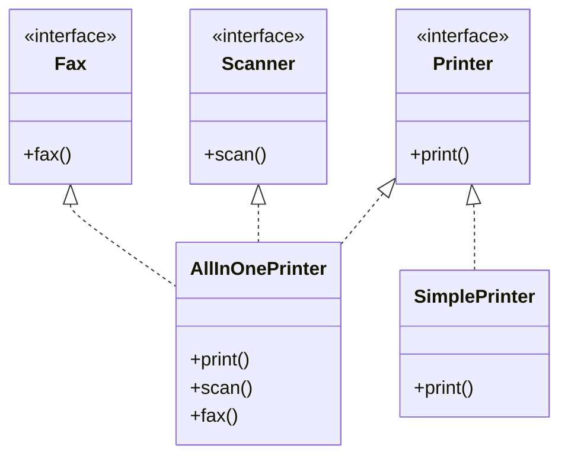
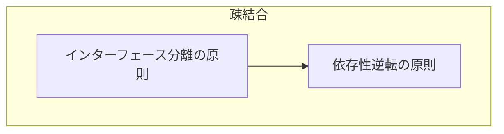

# インターフェース分離の原則 (Interface Segregation Principle)

## インターフェース分離の原則とは

**インターフェースのクライアントにとって利用しないフィールドやメソッドへの依存を矯正してはならない。**

インターフェースや抽象クラスの抽象メソッドは未実装のままではエラーとなり、サブクラスでの実装を強制することができる。
だが、実装クラスに関係ないメソッドがあったしても実装しなければいけない。

➡️ インターフェースに用意されている**不必要なフィールドやメソッドにクライアントが依存しなくてもいいようにインターフェースは適切に分割すべき**

## インターフェース分離の原則に違反した例

たとえば「多機能プリンタ」を考えてみましょう。  
印刷・スキャン・FAX の機能をすべて持つ `MultiFunctionDevice` インターフェースを定義し、それをすべてのプリンタに強制している例です。
#### クラス図



#### コード
```ts
interface MultiFunctionDevice {
  print(): void;
  scan(): void;
  fax(): void;
}

class AllInOnePrinter implements MultiFunctionDevice {
  print() { console.log('印刷しました'); }
  scan() { console.log('スキャンしました'); }
  fax()  { console.log('FAXを送信しました'); }
}

class SimplePrinter implements MultiFunctionDevice {
  print() { console.log('印刷しました'); }
  scan() { throw new Error('このプリンタはスキャンできません'); }
  fax()  { throw new Error('このプリンタはFAXできません'); }
}
```


### ❌ 問題点

- `SimplePrinter` はスキャンもFAXもできないのに、無理やり実装を強制されている
- 利用者も「使えない機能」を見えてしまう
- 将来の変更時に、関係のない機能まで対応を強いられる

---

## 原則に違反するとどうなるか

```ts
const printer = new SimplePrinter();
printer.scan(); // 実行時にエラー
```

- クライアントコードが「スキャンできる」と誤解して使ってしまう
- 実行時エラーの原因となり、信頼性を損なう

---

## 解決策：機能ごとにインターフェースを分割する

#### クラス図



#### コード
```ts
interface Printer {
  print(): void;
}

interface Scanner {
  scan(): void;
}

interface Fax {
  fax(): void;
}

class AllInOnePrinter implements Printer, Scanner, Fax {
  print() { console.log('印刷しました'); }
  scan()  { console.log('スキャンしました'); }
  fax()   { console.log('FAXを送信しました'); }
}

class SimplePrinter implements Printer {
  print() { console.log('印刷しました'); }
}
```

このように分離することで、「必要な機能だけ」を実装し、「必要なインターフェースだけ」に依存できるようになります。

→ インターフェース分離の原則に準拠した設計になります。

## 他のSOLID原則との関連

#### 関連図



- **依存性逆転の原則（DIP）** では、具象クラスではなく抽象に依存する設計が求められます。
  その際、インターフェースが肥大化していると、利用者に不要な依存を強制することになります。
- **インターフェース分離の原則（ISP）** を適用することで、必要最小限のインターフェースに依存できるようになり、DIPの柔軟性と保守性をさらに高めます。
