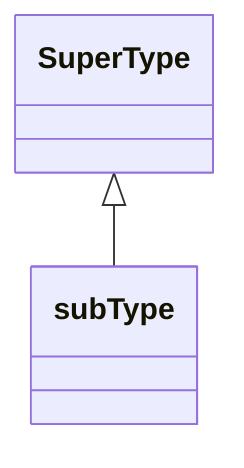
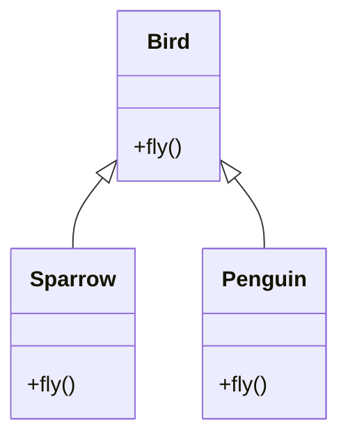
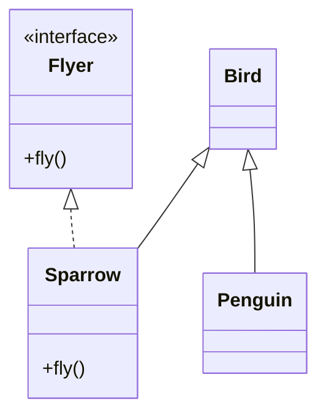
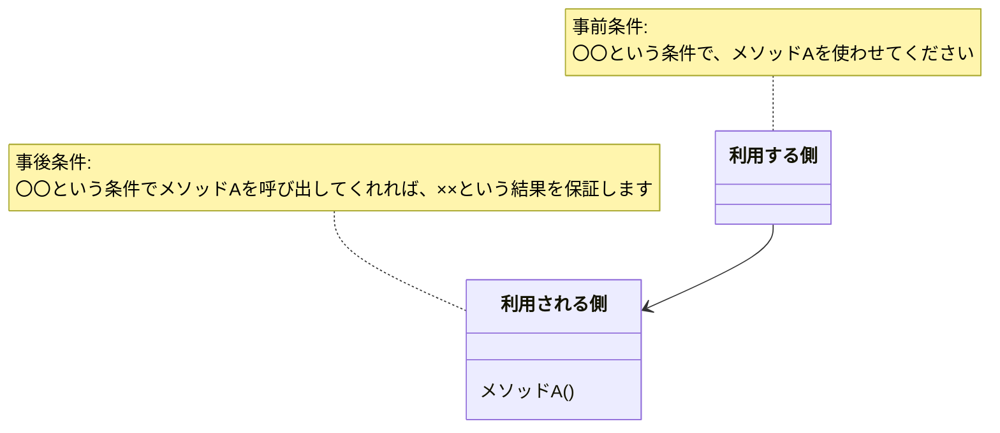
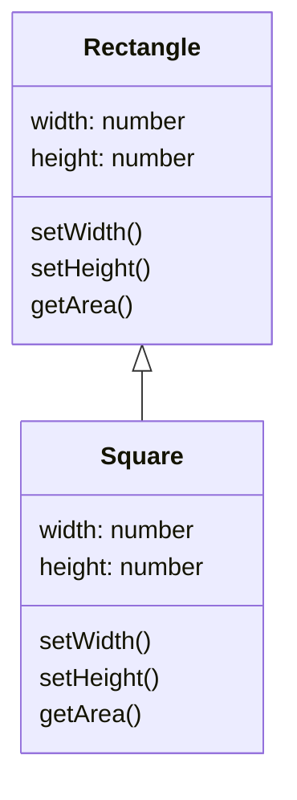
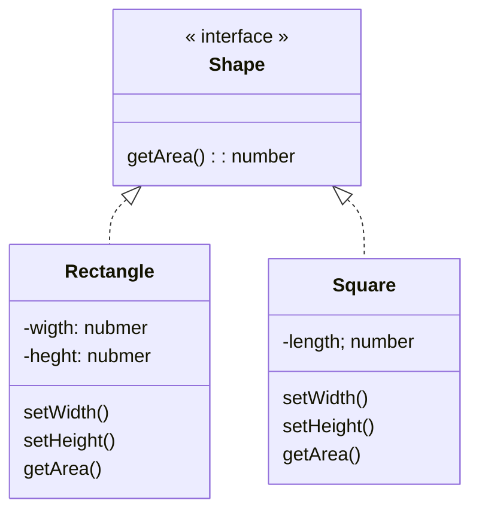
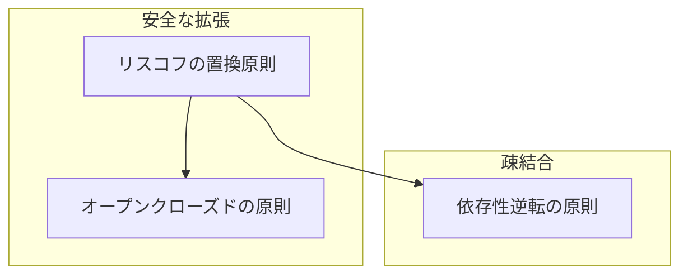

# リスコフの置換原則 (Liskov Substitution Principle)

## リスコフの置換原則とは

サブタイプは、そのスーパータイプと置換可能でなければならない  
- **正しい継承 = 「Is-a 関係」+「振る舞いの同等性」**

#### クラス図



## リスコフの置換原則に違反した例

たとえば、`Bird` クラスを継承した `Penguin` クラスがあるとします。  
`Bird` クラスには `fly()` メソッドがあり、すべての鳥が飛べる前提です。

#### クラス図

#### コード
```ts
class Bird {
  fly(): void {
    console.log('空を飛ぶ');
  }
}

class Sparrow extends Bird {}

class Penguin extends Bird {}
```

### ❌ 問題点

- `Penguin`（ペンギン）は鳥ではあるが、飛べません。
- `Bird` 型で受け取って `fly()` を呼ぶと、`Penguin` では意図しない動作や例外が発生するかもしれません。
- この設計は **「型の置き換えができない」＝リスコフの置換原則違反** です。

## 原則に違反するとどうなるか

```ts
function makeItFly(bird: Bird) {
  bird.fly();
}

const penguin = new Penguin();
makeItFly(penguin); // 👈 ここで誤動作、またはエラーの可能性
```

- 利用者は「Birdならばflyできる」と信じて使っているのに、
- 実際には `Penguin` が `fly()` を正しく扱えないためバグの原因になります。

## 解決策：共通の動作に着目したインターフェースを使う

「飛べる」かどうかに注目した設計に変えましょう。  
つまり、「鳥＝飛ぶもの」という前提ではなく、「飛べる鳥」と「飛べない鳥」を分けて扱うようにします。
#### クラス図


#### コード
```ts
interface Flyer {
  fly(): void;
}

class Bird {
  // 共通の鳥の性質（例: 鳴くなど）
}

class Sparrow extends Bird implements Flyer {
  fly(): void {
    console.log('スズメが飛んだ');
  }
}

class Penguin extends Bird {
  // fly() は実装しない
}
```


このようにすれば、`Flyer` 型に対してのみ `fly()` を呼び出せるようになるため、  
**置き換え可能な設計＝リスコフの置換原則に準拠した設計**になります。

## リスコフの置換原則に違反するとどうなるか

- 利用者が想定しない挙動によるバグが発生する可能性が高まる
   - 利用者はスーパータイプとサブタイプは同じ挙動を期待して利用する
   - 利用者がサブタイプまで全て理解した上で利用する必要がある
- リコリスの置換原則に違反したコードを使うと、オープンクローズドの原則に違反する可能性が高まる
   - 利用側でクラスを判別するための分岐を入れののはNG

      ```ts
      if (r instanceof Square) {
        //...
      }
      ```

## 振る舞いの変更に気付くには

スーパータイプとサブタイプで振る舞いが変更されていることを確認する最も簡単な方法は**単体テストを書く**ことです。

たとえば、長方形（Rectangle）を継承した正方形（Square）があるとします。

```ts
class Rectangle {
  width = 0;
  height = 0;
  setWidth(width: number) {
    this.width = width;
  }
  setHeight(height: number) {
    this.height = height;
  }
  getArea(): number {
    return this.width * this.height;
  }
}

class Square extends Rectangle {
  // 正方形は幅と高さが同じなので、両方を同時に設定
  setWidth(width: number) {
    super.setWidth(width);
    super.setHeight(width);
  }
  setHeight(height: number) {
    super.setWidth(height);
    super.setHeight(height);
  }
}
```

#### 利用コード
```ts
const calculateArea = (r: Rectangle, width: number, height: number): number => {
  r.setWidth(width);
  r.setHeight(height);
  return r.getArea();
};
```

#### テストコード
```ts
describe('Rectangle Test', () => {
  test('Rectangle getArea', () => {
    const r = new Rectangle();
    expect(calculateArea(r, 3, 4)).toBe(12); // ✅ 成功
  });

  test('Square getArea', () => {
    const s = new Square();
    expect(calculateArea(s, 3, 4)).toBe(12); // ❌ 失敗（16になる）
  });
});
```

**問題**：`Square`は`Rectangle`を継承しているのに、同じ関数で異なる結果が返ってきます。これは**リスコフの置換原則違反**です。

利用者（`calculateArea`関数）は「幅3、高さ4なら面積12」を期待しているのに、`Square`では「最後に設定した値で両方が上書きされる」ため、面積が16（4×4）になってしまいます。

## 補足： 契約による設計

::: info 契約による設計とは
プログラムコードの中に、満たすべき仕様（契約）を明示的に記述することで、厳密で信頼性の高いソフトウェアを構築するための設計技法です。
:::



### 事前条件とは

::: tip 事前条件（Precondition）
メソッド開始時に保証されるべき条件
- メソッドの引数
- メソッド開始時のインスタンスの状態
:::

### 事後条件とは

::: tip 事後条件（Postcondition）
メソッド正常終了時に保証されるべき条件
- メソッドの正常終了時のインスタンスの状態
- クライアントに返す戻り値
:::

### 契約による設計においての、サブタイプの事前条件と事後条件

::: warning LSPを満たすための条件
- サブタイプの**事前条件はスーパータイプと同じかそれより弱い条件**と置き換え、
- サブタイプの**事後条件はスーパータイプと同じかそれより強い条件**と置き換える。
:::

###  事前条件はスーパータイプと同じかそれより弱い条件

#### スーパータイプ

```ts
methoda(x: nubmer) {
  // 事前条件: x > 0
}
```
#### サブタイプ
```ts
methoda(x: nubmer) {
  // 事前条件: x > 10 👈 NG: より強い事前条件になっているため、リスコフの置換条件違反
  // 事前条件: x > -1 👈 OK: より弱い事前条件になっている
}
```

###  事後条件はスーパータイプと同じかそれより強い条件

#### スーパータイプ

```ts
setWidth(width: nubmer) {
  this.width = width;
  // 事後条件
  // this.width === width && this.height === oldHeight 👈 高さは変化しない
}
```

#### サブタイプ
```ts
setWidth(width: nubmer) {
  super.setWidth(width);
  super.setHight(width);
  // 事後条件
  // this.width === width 👈 NG: 高さが変化し、スーパータイプより事後条件となるため、リスコフの置換条件違反
}
```

## TyepScriptコード例
#### クラス図

### 違反例


#### コード
```ts
// スーパータイプ
export class Rectangle {
  width = 0;
  height = 0;
  setWidth(width: number) {
    this.width = width;
  }
  setHeight(height: number) {
    this.height = height;
  }
  getArea(): number {
    return this.width * this.height;
  }
}

// サブタイプ
export class Squrare extends Rectangle {
  setWidth(width: number) {
    super.setWidth(width);
    super.setHeight(width);
  }

  setHeight(height: number) {
    super.setWidth(height);
    super.setHeight(height);
  }
}

export const f = (r: Rectangle, width: number, height: number): number => {
  r.setWidth(width);
  r.setHeight(height);
  return r.getArea();
};

const run = () => {
  console.log(f(new Rectangle(), 3, 4));
  console.log(f(new Squrare(), 3, 4));
};

run();
```

##### 実行結果

```
12
16 // 想定（12）外の回答
```

#### ユニットテスト

```ts
import { f, Rectangle, Squrare } from './index';

describe('Rectangle Test', () => {
  test('Rectangle getArea', () => {
    const r1 = new Rectangle();
    expect(f(r1, 3, 4)).toBe(12);
  });
  test('Square getArea', () => {
    const r1 = new Square();
    expect(f(r1, 3, 4)).toBe(12); // 👈 16となり、テストに失敗する
  });
});
```

##### 実行結果

```
TestSuites: 1 failed, 1 total
```

### 解決策
#### クラス図



#### コード
```ts
interface Shape {
  getArea(): number;
}

class Rectangle implements Shape {
  constructor(private width: number = 0, private height: number = 0) {}
  setWidth(width: number) {
    this.width = width;
  }
  setHeight(height: number) {
    this.height = height;
  }
  getArea(): number {
    return this.width * this.height;
  }
}

class Square {
  constructor(private length: number = 0) {}
  setLength(length: number) {
    this.length = length;
  }
  getArea(): number {
    return this.length * this.length;
  }
}

const f = (shape: Shape) => {
  console.log(shape.getArea());
};

const run = () => {
  const rectable = new Rectangle();
  rectable.setWidth(3);
  rectable.setHeight(4);
  f(rectable);

  const square = new Square();
  square.setLength(3);
  f(square);
};

run();
```


##### 実行結果

```
12
9
```

## 他のSOLID原則との関連

#### 関連図



- **オープンクローズドの原則** は「既存コードを変更せずに機能を拡張する」ことを目指しますが、その前提として「サブタイプが正しく置き換え可能であること（＝リスコフの置換原則）」が必要です。
- **依存性逆転の原則** では、具象クラスではなく抽象（インターフェースなど）に依存することで拡張性を高めますが、これも「サブタイプが安全に置き換え可能であること」が前提になります。