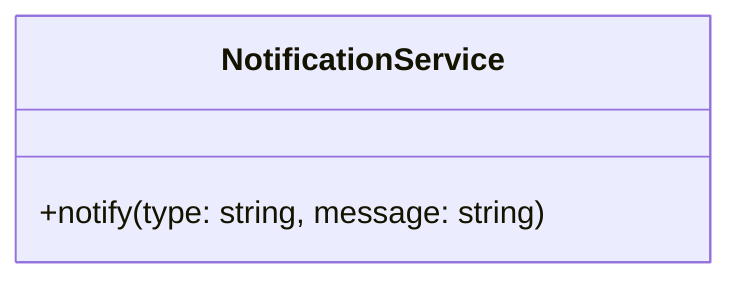
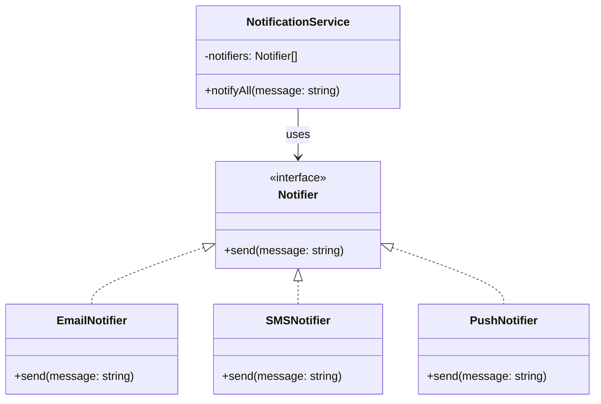
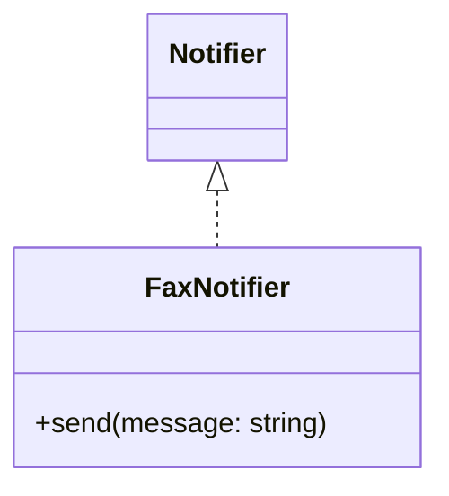
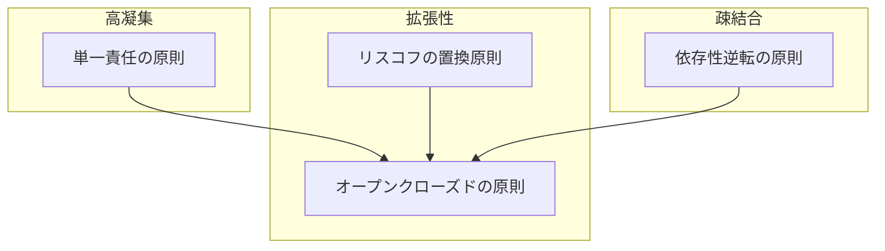

# オープンクローズドの原則 (Open-Closed Principle)

## この原則の要点

**ソフトウェアの構成要素は「拡張に開かれ」「修正に閉じられている」べき**という原則です。

::: info OCPの2つの側面
- **拡張に開かれている**：新しい要件や機能を追加できる
- **修正に閉じられている**：既存の安定したコードを変更しなくてもよい
:::

## この原則が解決する問題

::: warning OCPに違反すると起こる問題
- 新機能追加のたびに既存コードを変更する必要がある
- 既存コードの修正によるバグ発生リスク
- テスト範囲が広がり、保守コストが増大
:::

## 原則に違反した例

たとえば「アプリ通知システム」を考えてみましょう。  
ユーザーに対して様々な方法で通知を送る仕組みです。

#### クラス図

#### コード
```ts
class NotificationService {
  notify(type: string, message: string) {
    if (type === 'email') {
      console.log(`メール送信: ${message}`);
    } else if (type === 'sms') {
      console.log(`SMS送信: ${message}`);
    } else if (type === 'push') {
      console.log(`プッシュ通知: ${message}`);
    }
  }
}
```


### ❌ 問題点（原則に違反）

- 通知方法が増えるたびに、`NotificationService`の中身を書き換える必要がある
- テスト済みの既存コードに手を加えることになるため、バグのリスクが高まる
- 単一責任の原則にも違反している（通知種別ごとの責任が1クラスに集中）

## 原則違反のリスク

```ts
const service = new NotificationService();
service.notify('email', 'ようこそ！');
service.notify('fax', '契約完了'); // faxが新しく追加されたが、まだ対応していない
```

- `fax`に対応するには、既存クラスを開いて書き換える必要がある
- これは「修正に閉じていない」＝ OCP に違反している状態

## 解決策：通知手段を拡張できる設計にする

インターフェースで通知手段を抽象化し、通知ごとにクラスを分離すれば、  
新しい通知方式を追加しても既存コードを触らずに済みます。

#### クラス図



#### コード

```ts
interface Notifier {
  send(message: string): void;
}

class EmailNotifier implements Notifier {
  send(message: string): void {
    console.log(`メール送信: ${message}`);
  }
}

class SMSNotifier implements Notifier {
  send(message: string): void {
    console.log(`SMS送信: ${message}`);
  }
}

class PushNotifier implements Notifier {
  send(message: string): void {
    console.log(`プッシュ通知: ${message}`);
  }
}

class NotificationService {
  constructor(private notifiers: Notifier[]) {}

  notifyAll(message: string) {
    this.notifiers.forEach((notifier) => notifier.send(message));
  }
}
```

#### 使用例

```ts
// 1つの通知手段だけを使う場合
const emailOnlyService = new NotificationService([
  new EmailNotifier()
]);
emailOnlyService.notifyAll('メンテナンスのお知らせ');
// メール送信: メンテナンスのお知らせ

// 複数の通知手段を組み合わせる場合
const multiChannelService = new NotificationService([
  new EmailNotifier(),
  new SMSNotifier(),
  new PushNotifier()
]);
multiChannelService.notifyAll('重要なお知らせ！');
// メール送信: 重要なお知らせ！
// SMS送信: 重要なお知らせ！
// プッシュ通知: 重要なお知らせ！
```


### ✅ 利点

- `FaxNotifier`を新規追加するだけで対応でき、既存のコードは一切変更しない
- 新規拡張は「開かれて」いるが、既存の動作には「閉じて」いる状態
- OCP（オープンクローズドの原則）を自然に満たしている

#### クラス図


#### コード
```ts
class FaxNotifier implements Notifier {
  send(message: string): void {
    console.log(`FAX送信: ${message}`);
  }
}

const service = new NotificationService([
  new EmailNotifier(),
  new SMSNotifier(),
  new FaxNotifier(), // 新たに追加
]);

service.notifyAll('キャンペーンのお知らせ！');
```


## 実務で役立つヒント

::: tip OCPを実現するための設計習慣
- 変更の可能性がある部分を特定し、それを「抽象」として切り出す
- ポリモーフィズムを活用して拡張ポイントを明確にする
- 設計段階で「この機能は将来的に種類が増えるかもしれない」と考える習慣をつける
- インターフェース設計が重要：適切に抽象化された「契約」を定義する
:::

## 他のSOLID原則との関連

#### 関連図



- **単一責任の原則** は、責任を1つに絞ることで、変更理由を限定できる。これによりOCPの「既存コードを変更せずに拡張する」設計がしやすくなる。
- **リスコフの置換原則** に従えば、サブタイプに置き換えても振る舞いが維持されるため、新しい実装の追加が安全に行える。OCPの前提として重要。
- **依存性逆転の原則** により、具象クラスへの直接依存を避け、抽象（インターフェースなど）を通じて機能を切り替えることで、拡張しやすい構造を実現できる。

## まとめ

オープンクローズドの原則は、ソフトウェアの変更に対する柔軟性と安定性のバランスを実現します。
「拡張に開かれ、修正に閉じる」設計により、機能追加が容易で安全なコードベースを構築できます。
