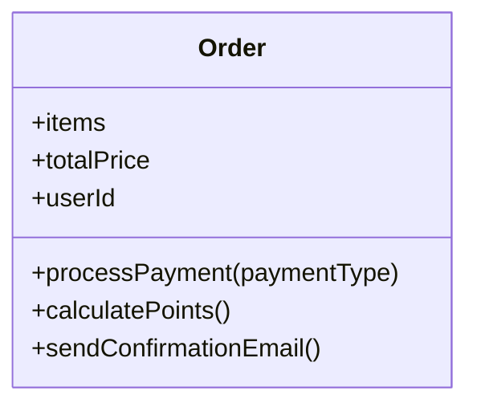
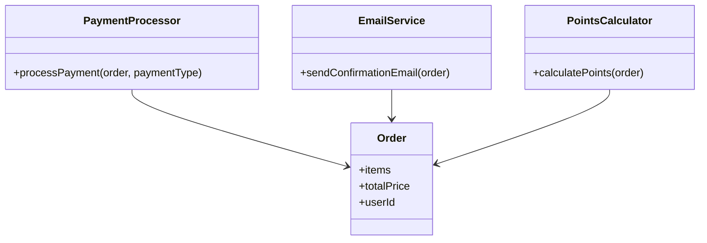
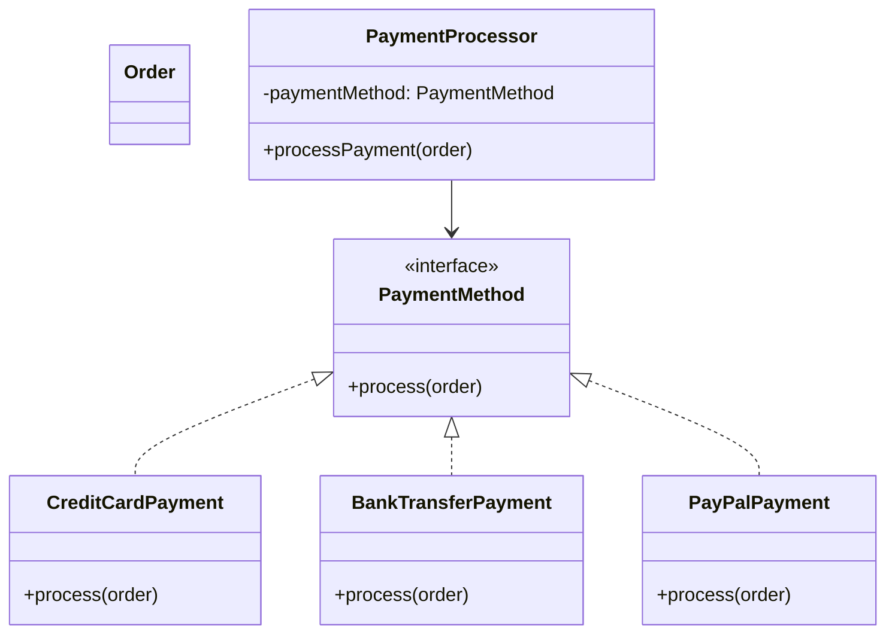
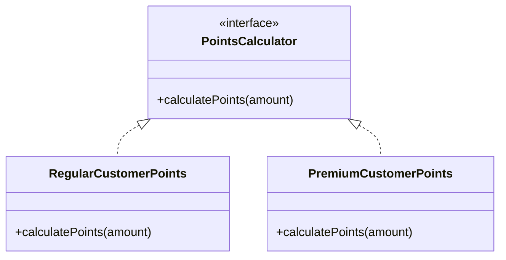
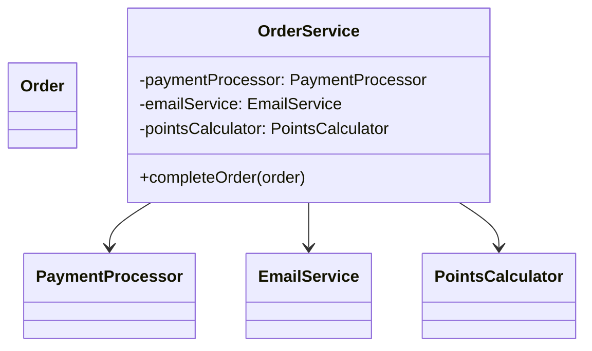

# SOLID原則ケーススタディ：ECサイト機能拡張

## シナリオ

あなたは既存のECサイトに新しい支払い方法やロイヤリティプログラムを追加する必要があります。  
しかし現在のコードはSOLID原則に従っておらず、機能追加のたびに既存コードを変更しなければならず、保守性に課題があります。


## 非SOLIDなコード（Before）
#### クラス図

#### コード
```ts
class Order {
  items = [];
  totalPrice = 0;
  userId = '';
  
  // 支払い処理
  processPayment(paymentType: string) {
    if (paymentType === 'credit') {
      console.log('クレジットカード処理');
    } else if (paymentType === 'bank') {
      console.log('銀行振込処理');
    }
    // 新しい支払い方法を追加するたびにこのメソッドを変更する必要がある
  }
  
  // ポイント計算
  calculatePoints() {
    return this.totalPrice * 0.01;
  }
  
  // 注文確認メール送信
  sendConfirmationEmail() {
    console.log('注文確認メール送信');
  }
}
```


## SOLID原則に準拠したリファクタリング（After）

### ✅ 単一責任の原則（SRP）
#### クラス図

#### コード
```ts
class Order {
  items = [];
  totalPrice = 0;
  userId = '';
}

class PaymentProcessor {
  processPayment(order: Order, paymentType: string) {
    // 支払い処理のみに責任を持つ
  }
}

class EmailService {
  sendConfirmationEmail(order: Order) {
    // メール送信のみに責任を持つ
  }
}

class PointsCalculator {
  calculatePoints(order: Order) {
    // ポイント計算のみに責任を持つ
  }
}
```


### ✅ オープンクローズド原則（OCP）＋リスコフの置換原則（LSP）
#### クラス図

#### コード
```ts
interface PaymentMethod {
  process(order: Order): void;
}

class CreditCardPayment implements PaymentMethod {
  process(order: Order): void {
    console.log('クレジットカード処理');
  }
}

class BankTransferPayment implements PaymentMethod {
  process(order: Order): void {
    console.log('銀行振込処理');
  }
}

class PayPalPayment implements PaymentMethod {
  process(order: Order): void {
    console.log('PayPal処理');
  }
}

class PaymentProcessor {
  constructor(private paymentMethod: PaymentMethod) {}
  
  processPayment(order: Order) {
    this.paymentMethod.process(order);
  }
}
```


### ✅ インターフェース分離の原則（ISP）

#### クラス図


#### コード

```ts
interface PointsCalculator {
  calculatePoints(amount: number): number;
}

class RegularCustomerPoints implements PointsCalculator {
  calculatePoints(amount: number): number {
    return amount * 0.01;
  }
}

class PremiumCustomerPoints implements PointsCalculator {
  calculatePoints(amount: number): number {
    return amount * 0.05;
  }
}
```


### ✅ 依存性逆転の原則（DIP）
#### クラス図


#### コード
```ts
class OrderService {
  constructor(
    private paymentProcessor: PaymentProcessor,
    private emailService: EmailService,
    private pointsCalculator: PointsCalculator
  ) {}

  completeOrder(order: Order) {
    this.paymentProcessor.processPayment(order);
    this.emailService.sendConfirmationEmail(order);
    const points = this.pointsCalculator.calculatePoints(order.totalPrice);
    console.log(`ポイント付与: ${points}pt`);
  }
}
```


## ✅ この設計の利点

- 支払い手段の追加・変更がクラス追加のみで可能（OCP）
- ポイント計算方式の変更が柔軟に（ISP）
- テスト容易（依存オブジェクトをモック注入できる）（DIP）
- 各クラスが1つの責任に集中し、保守性が高い（SRP）