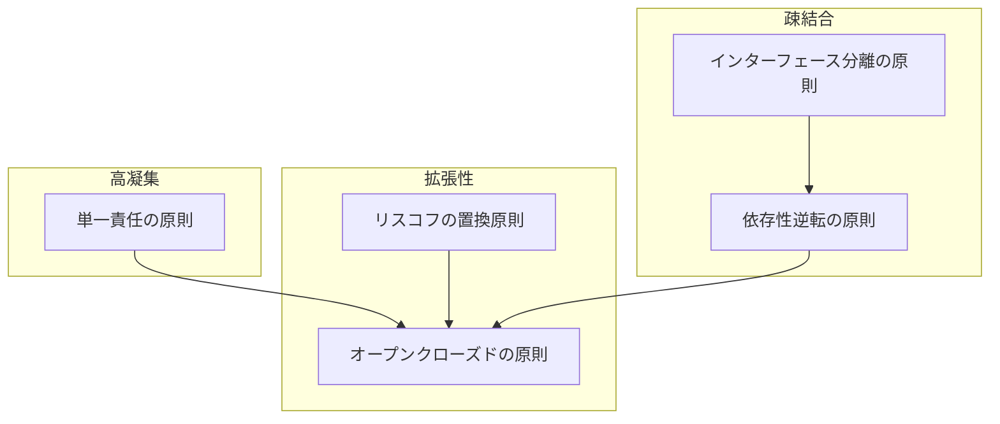

# SOLID原則間の関連性

各原則は独立していますが、相互に関連し合っています。

- **単一責任の原則**を守ることで、一つのクラスが複数の役割を持たなくなり、**オープンクローズドの原則**の適用が容易になります
- **リスコフの置換原則**は**オープンクローズドの原則**を支え、拡張性の高いコードを実現します
- **インターフェース分離の原則**と**依存性逆転の原則**は互いに補完し合い、疎結合なモジュール設計を促進します

#### SOLID原則の関連図

