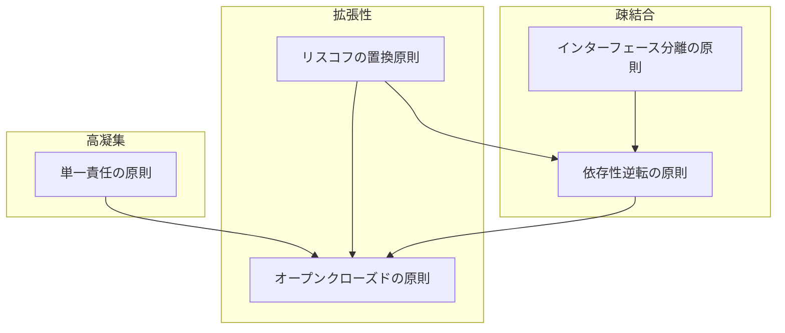

# SOLID原則間の関連性

各原則は独立していますが、相互に関連し合っています。

#### SOLID原則の関連図

> ※ 原則間の矢印は「この原則の適用には、矢印元の原則が前提または補助となる」ことを意味します。

- **単一責任の原則（SRP）**：責任を明確に分離することで、クラスの変更理由を限定し、OCPによる安全な拡張が可能になる
- **オープンクローズドの原則（OCP）**：既存コードを変更せずに機能を追加できるが、そのためにはSRPによる分離とLSPによる正しいサブタイプ設計が必要
- **リスコフの置換原則（LSP）**：抽象を使った拡張時に、サブクラスが期待どおりに機能することで、OCPやDIPの信頼性を支える
- **インターフェース分離の原則（ISP）**：利用者ごとに最小限のインターフェースを提供することで、疎結合と柔軟な拡張性を両立
- **依存性逆転の原則（DIP）**：抽象に依存する構造をつくることで、OCP・LSPと連携し、モジュールの独立性と再利用性を高める

