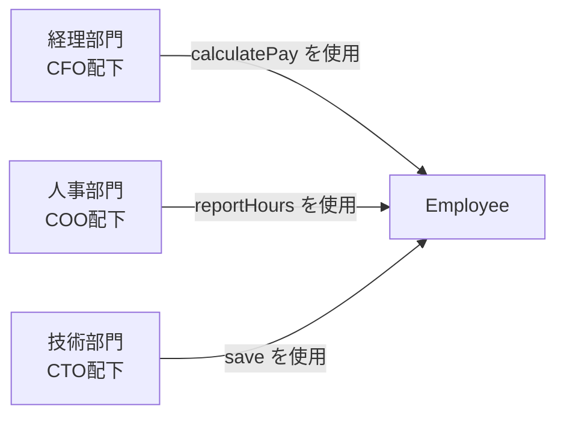
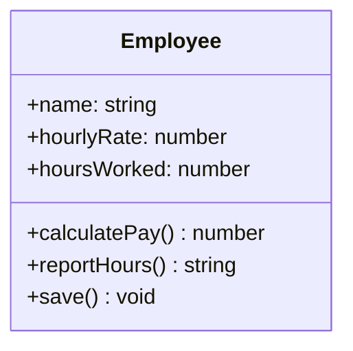
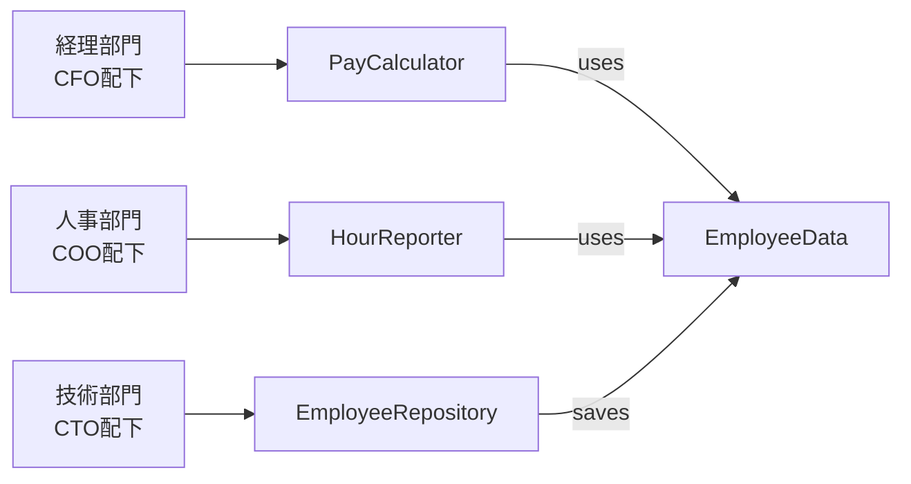
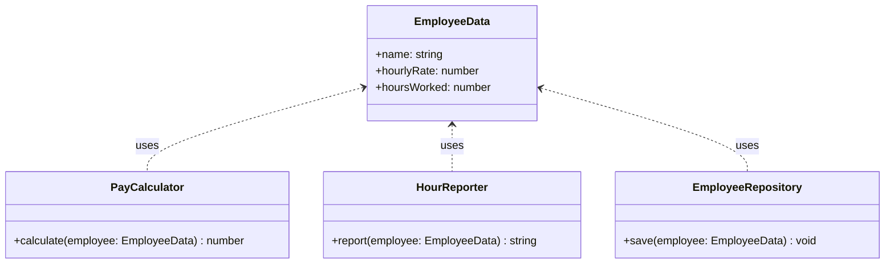
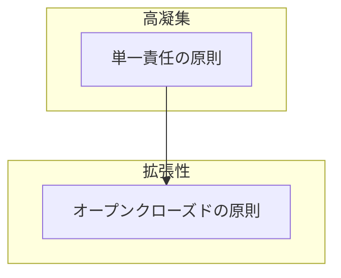
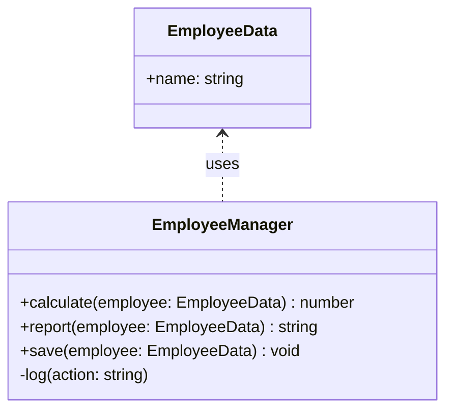
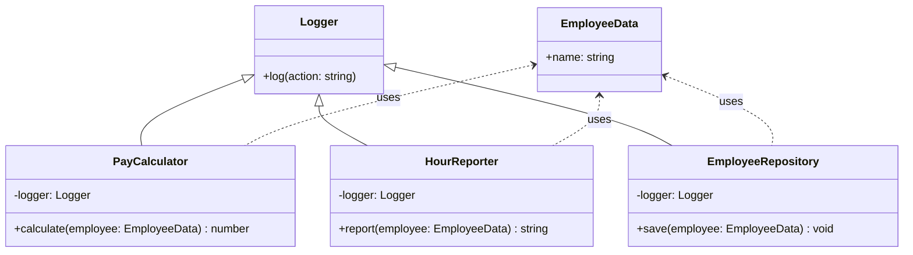
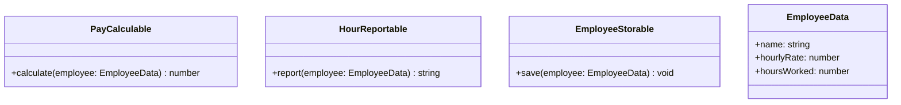

# 単一責任の原則 (Single Responsibility Principle)
## 単一責任の原則とは

**クラスは「たった一人のアクター（利用者・責任者）」に対して責任を持つべき**という原則です。

> [!CAUTION]
> 「単一の責任を持つべき」は 簡略化された表現 で、「たった一人のアクター（利用者・利害関係者）に対して責任を持つべき」が 本質的な意味です。
> 本来の意図は、「1つの変更理由（=1人のアクター）に対してのみ責任を持つ」ということです。

> [!NOTE]
> 単一責任の原則（Single Responsibility Principle）は、ロバート・C・マーティン（Uncle Bob）によって提唱された概念ですが、実はいくつかの表現方法があります。
> マーティン自身は「クラスを変更する理由は1つだけであるべき」という定義をしており、これを「1つのアクター」という観点から説明しています。アクターとは、変更を要求する利害関係者（ステークホルダー）や役割を指します。
> つまり、1つのクラスは1人のアクター（ユーザーや関係者）からの変更要求にのみ対応すべきという意味です。

## なぜ「アクター」の観点が重要か？

単一責任の原則は、しばしば「クラスは1つの責任しか持つべきでない」と表現されますが、
この「責任」とは誰のためのものか、という **「アクター」** の視点が本質になります。

Robert C. Martin（提唱者）は次のように述べています。

> "A class should have only one reason to change."
> クラスには変更理由がひとつだけであるべき

この「変更理由」とは、**そのクラスに変更を求める人や立場＝アクター**を意味します。


### アクターとは？

アクターとは「そのクラスの変更を要求する主体」です。クラスの振る舞いや構造に対して**変更を要求し得る主体**を指します。
つまり「そのクラスを利用している者（人・モジュール・他のシステム）」と言い換えることもできます。
システムを利用するユーザーだけでなく、開発・保守を行う運用者や管理者、外部インターフェースの仕様策定者なども含まれます。
たとえば、以下のようなものが該当します。

- **ビジネスアクター**：経営層・営業部門・顧客など、ビジネス要件の変更を要求する人々
- **技術的アクター**：DBA・運用担当・開発者など、技術的・実装上の理由で変更を要求する人々
- **外部システム**：APIの利用者、他のクラスやモジュールなど、インターフェースの変更を要求し得るもの
- **規格・ルール**：法制度やドメインルールなど、外部の制約により変更を強いる存在

これらが1つのクラスに混在すると、**変更理由が複数になり、保守が困難になる**のです。

## 単一責任に違反している例

以下は、従業員（Employee）に関する処理を1つのクラスに詰め込んだ例です。

#### アクターとクラスの関係


この図が示すように、**同じEmployeeクラスに対して、3つの異なる部門（アクター）が異なる目的で変更を要求する**状況になっています。

#### クラス図


#### コード
```ts
class Employee {
  constructor(
    public name: string,
    public hourlyRate: number,
    public hoursWorked: number
  ) {}

  // 経理部門の関心事：給与計算
  calculatePay(): number {
    return this.hourlyRate * this.hoursWorked;
  }

  // 人事部門の関心事：労働時間レポート
  reportHours(): string {
    return `${this.name}: ${this.hoursWorked}時間`;
  }

  // 技術部門（DBA）の関心事：データベース保存
  save(): void {
    console.log(`データベースに保存: ${this.name}`);
  }
}
```

### 問題点

このクラスは**3つの異なるアクター**に対して責任を持っています。

1. **経理部門（CFO配下）** → `calculatePay()`の仕様を変更したい
   - 例：残業代の計算ロジックを変更、控除項目の追加
2. **人事部門（COO配下）** → `reportHours()`の仕様を変更したい
   - 例：レポート形式の変更、集計期間の変更
3. **技術部門（CTO配下）** → `save()`の仕様を変更したい
   - 例：データベースの種類変更、保存形式の変更

### 具体的なリスク

#### ケース1：給与計算ロジックの変更が人事レポートに影響
```ts
class Employee {
  constructor(
    public name: string,
    public hourlyRate: number,
    public hoursWorked: number
  ) {}

  // 経理部門が「正規時間と残業時間を分けて計算したい」と要求
  calculatePay(): number {
    const regularHours = Math.min(this.hoursWorked, 160);
    const overtimeHours = Math.max(this.hoursWorked - 160, 0);
    return regularHours * this.hourlyRate + overtimeHours * this.hourlyRate * 1.5;
  }

  // この変更により、reportHours() も影響を受ける可能性
  reportHours(): string {
    // hoursWorked の解釈が変わってしまうかもしれない
    return `${this.name}: ${this.hoursWorked}時間`;
  }

  save(): void {
    console.log(`データベースに保存: ${this.name}`);
  }
}
```

**問題**：経理部門のための変更が、人事部門が使っている`reportHours()`の挙動に影響を与える可能性があります。

#### ケース2：データベース変更がビジネスロジックに影響
```ts
class Employee {
  constructor(
    public name: string,
    public hourlyRate: number,
    public hoursWorked: number
  ) {}

  calculatePay(): number {
    return this.hourlyRate * this.hoursWorked;
  }

  reportHours(): string {
    return `${this.name}: ${this.hoursWorked}時間`;
  }

  // DBAが「データベースをMongoDBに変更したい」と要求
  save(): void {
    // MongoDB用の保存処理に変更
    const doc = {
      name: this.name,
      hourlyRate: this.hourlyRate,
      hoursWorked: this.hoursWorked
    };
    console.log(`MongoDBに保存: ${JSON.stringify(doc)}`);
  }
}
```

**問題**：データベースの変更のためにEmployeeクラスを修正すると、給与計算や労働時間レポートのテストも全てやり直す必要があります。


## 解決策：責任を分離する

各アクターの責任を別々のクラスに分離します。

#### アクターとクラスの関係（改善後）


この構造では、各アクターが自分の関心事だけを持つクラスと関わるため、**変更の影響が他のアクターに波及しません**。

#### クラス図


#### コード
```ts
// 純粋なデータクラス（全アクターが共通で使うデータ構造）
class EmployeeData {
  constructor(
    public name: string,
    public hourlyRate: number,
    public hoursWorked: number
  ) {}
}

// 経理部門の責任
class PayCalculator {
  calculate(employee: EmployeeData): number {
    return employee.hourlyRate * employee.hoursWorked;
  }
}

// 人事部門の責任
class HourReporter {
  report(employee: EmployeeData): string {
    return `${employee.name}: ${employee.hoursWorked}時間`;
  }
}

// 技術部門の責任
class EmployeeRepository {
  save(employee: EmployeeData): void {
    console.log(`データベースに保存: ${employee.name}`);
  }
}
```

### 実行例

```ts
const employee = new EmployeeData('田中太郎', 2000, 160);

const payCalculator = new PayCalculator();
const hourReporter = new HourReporter();
const repository = new EmployeeRepository();

console.log(payCalculator.calculate(employee));  // 320000
console.log(hourReporter.report(employee));      // 田中太郎: 160時間
repository.save(employee);                        // データベースに保存: 田中太郎
```

### 分離のメリット

1. **変更の局所化**
   - 経理部門が給与計算ロジックを変更しても、`PayCalculator`だけを修正すればよい
   - 人事部門やDBAの処理には一切影響しない

2. **テストの簡素化**
   - 給与計算のテストは`PayCalculator`だけをテストすればよい
   - データベース処理のモックを用意する必要がない

3. **並行開発の実現**
   - 経理部門向けの開発、人事部門向けの開発、DBA向けの開発を独立して進められる

## 状態（フィールド）も責任に含まれる

単一責任の原則は「メソッド（処理）」だけでなく、「フィールド（状態）」にも関係します。
たとえば、あるクラスが従業員の基本情報と給与計算用の一時データを同時に保持している場合、
それぞれが異なるアクターの責任領域であれば、分離すべき設計かもしれません。

- 従業員の基本情報（名前、時給） → 人事部門の関心
- 給与計算用の一時データ（控除額、賞与） → 経理部門の関心

このように、**データ構造が異なるアクターに属する場合もSRP違反**となり得ます。

## 原則に違反するとどうなるか

- 一部の修正（例: 給与計算仕様変更）が他の処理（労働時間レポートやDB保存）にも影響する
- どの責任に影響があるかを特定するのに時間がかかる
- テスト対象が多く、修正のリスクが高くなる
- 複数のアクターが同じクラスを変更するため、**マージコンフリクトが発生しやすい**

## 責任の分離の判断基準（リファクタリング時の指針）

以下のような視点を持つと、クラスの責任が複数あるかを判断しやすくなります。

- メソッドごとに「これは誰のための処理か？」と問い直す
- 異なるアクターが関心を持つメソッドが混在していたら、分離の検討をする
- フィールドとメソッドが密接に関係している単位で、新しいクラスに抽出する
- **「このクラスを変更する理由は何個あるか？」を数える**
  - 2つ以上あればSRP違反の可能性が高い

## 他のSOLID原則との関連

#### 関連図




- **単一責任の原則** は、変更理由を1つに絞ることで、機能追加や仕様変更の影響範囲を限定できます。
  これにより、**オープンクローズドの原則（OCP）** が目指す「既存コードを変更せずに拡張する」ことが実現しやすくなります。
  例えば、給与計算仕様を変えたいとき、計算責任を分離しておけば、新たな `OvertimePayCalculator` を追加するだけで済み、既存の `HourReporter` や `EmployeeRepository` を変更する必要はありません。

## 補足：DRY原則との関係

DRY（Don't Repeat Yourself）原則は「同じコードやロジックを繰り返さない」ことを推奨しますが、
**単一責任の原則（SRP）と混同すると、設計が複雑になる危険があります。**

### ❌ よくある誤解

「同じ処理をしているから」といって、**異なる責任を持つ処理を1つの関数やクラスにまとめる**のは危険です。

#### クラス図


#### コード
```ts
class EmployeeManager {
  calculate(employee: EmployeeData): number {
    this.log('給与計算');
    return employee.hourlyRate * employee.hoursWorked;
  }

  report(employee: EmployeeData): string {
    this.log('レポート生成');
    return `${employee.name}: ${employee.hoursWorked}時間`;
  }

  save(employee: EmployeeData): void {
    this.log('保存');
    console.log(`保存: ${employee.name}`);
  }

  private log(action: string) {
    // ログ出力を共通化したつもりが…
    console.log(`[LOG]: ${action}`);
  }
}
```

このようにログ出力をDRYの観点から共通化すると、一見よさそうに見えますが、
ログ出力の責任が給与計算・レポート生成・保存それぞれの機能に密結合してしまっています。


### ✅ 正しい構成例：責任の分離
#### クラス図


#### コード
```ts
class EmployeeData {
  constructor(
    public name: string,
    public hourlyRate: number,
    public hoursWorked: number
  ) {}
}

// ログ機能を専用クラスとして分離
class Logger {
  log(action: string) {
    console.log(`[LOG]: ${action}`);
  }
}

class PayCalculator {
  constructor(private logger: Logger) {}

  calculate(employee: EmployeeData): number {
    this.logger.log('給与計算');
    return employee.hourlyRate * employee.hoursWorked;
  }
}

class HourReporter {
  constructor(private logger: Logger) {}

  report(employee: EmployeeData): string {
    this.logger.log('レポート生成');
    return `${employee.name}: ${employee.hoursWorked}時間`;
  }
}

class EmployeeRepository {
  constructor(private logger: Logger) {}

  save(employee: EmployeeData): void {
    this.logger.log('保存');
    console.log(`保存: ${employee.name}`);
  }
}
```

#### 実行例

```ts
const employee = new EmployeeData('田中太郎', 2000, 160);
const logger = new Logger();

const payCalculator = new PayCalculator(logger);
const hourReporter = new HourReporter(logger);
const repository = new EmployeeRepository(logger);

payCalculator.calculate(employee);  // [LOG]: 給与計算
hourReporter.report(employee);      // [LOG]: レポート生成
repository.save(employee);           // [LOG]: 保存
```

## 補足：インターフェースを使った責任の分離（TypeScript）

TypeScriptでは、異なるアクターの責任をインターフェースとして分離することで、
役割ごとの設計がしやすくなります。

#### クラス図


#### コード
```ts
interface PayCalculable {
  calculate(employee: EmployeeData): number;
}

interface HourReportable {
  report(employee: EmployeeData): string;
}

interface EmployeeStorable {
  save(employee: EmployeeData): void;
}
```

これらを実装するクラスは、単一のインターフェース（＝単一責任）を持つことになります。
この設計は、後に学ぶ「インターフェース分離の原則（ISP）」にもつながります。
