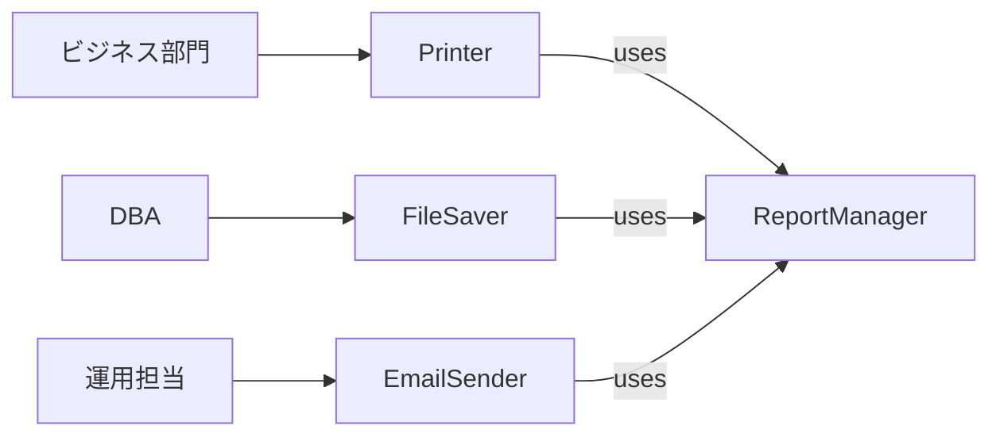
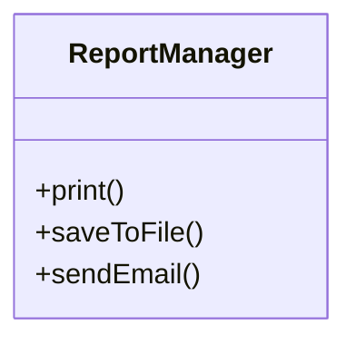
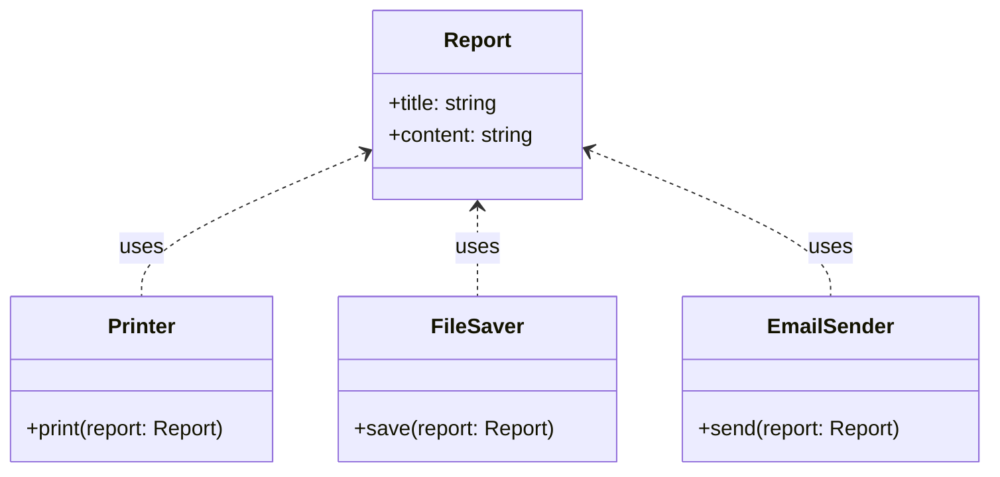
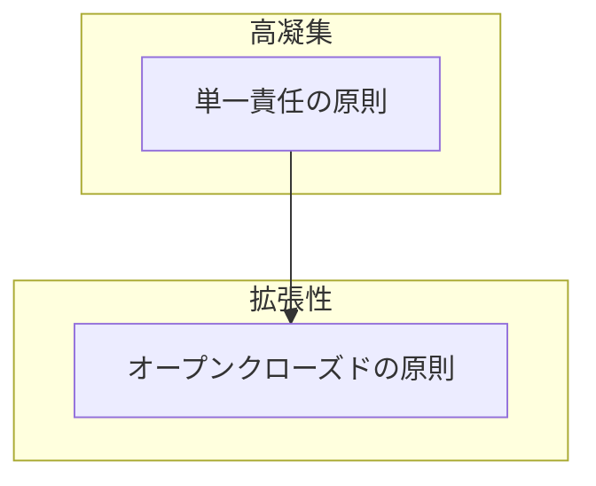
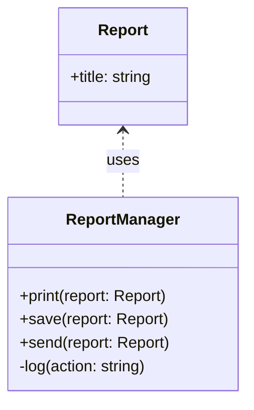
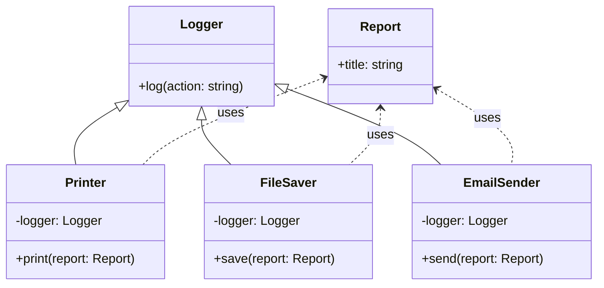
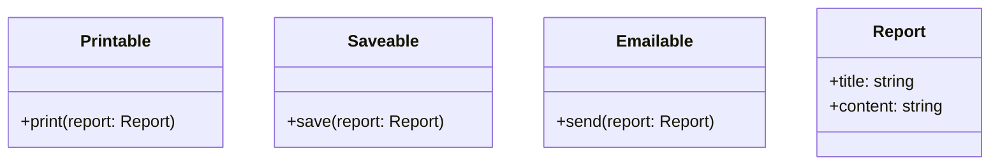

# 単一責任の原則 (Single Responsibility Principle)
## 単一責任の原則とは

**クラスは「たった一人のアクター（利用者・責任者）」に対して責任を持つべき**という原則です。

> [!CAUTION]  
> 「単一の責任を持つべき」は 簡略化された表現 で、「たった一人のアクター（利用者・利害関係者）に対して責任を持つべき」が 本質的な意味です。  
> 本来の意図は、「1つの変更理由（=1人のアクター）に対してのみ責任を持つ」ということです。

> [!NOTE]  
> 単一責任の原則（Single Responsibility Principle）は、ロバート・C・マーティン（Uncle Bob）によって提唱された概念ですが、実はいくつかの表現方法があります。  
> マーティン自身は「クラスを変更する理由は1つだけであるべき」という定義をしており、これを「1つのアクター」という観点から説明しています。アクターとは、変更を要求する利害関係者（ステークホルダー）や役割を指します。  
> つまり、1つのクラスは1人のアクター（ユーザーや関係者）からの変更要求にのみ対応すべきという意味です。

## なぜ「アクター」の観点が重要か？

単一責任の原則は、しばしば「クラスは1つの責任しか持つべきでない」と表現されますが、  
この「責任」とは誰のためのものか、という**「アクター」**の視点が本質になります。

Robert C. Martin（提唱者）は次のように述べています。

> “A class should have only one reason to change.”
> クラスには変更理由がひとつだけであるべき

この「変更理由」とは、**そのクラスに変更を求める人や立場＝アクター**を意味します。


### アクターとは？

アクターとは「そのクラスの変更を要求する主体」です。クラスの振る舞いや構造に対して**変更を要求し得る主体**を指します。  
つまり「そのクラスを利用している者（人・モジュール・他のシステム）」と言い換えることもできます。  
システムを利用するユーザーだけでなく、開発・保守を行う運用者や管理者、外部インターフェースの仕様策定者なども含まれます。  
たとえば、以下のようなものが該当します。

- **ビジネスアクター**：経営層・営業部門・顧客など、ビジネス要件の変更を要求する人々
- **技術的アクター**：DBA・運用担当・開発者など、技術的・実装上の理由で変更を要求する人々
- **外部システム**：APIの利用者、他のクラスやモジュールなど、インターフェースの変更を要求し得るもの
- **規格・ルール**：法制度やドメインルールなど、外部の制約により変更を強いる存在

これらが1つのクラスに混在すると、**変更理由が複数になり、保守が困難になる**のです。

### 🔎 例：SRP違反の構造

```ts
class ReportManager {
  generateReport()  // 経営層
  saveToDatabase()  // DBA
  sendEmail()       // 運用担当
}
```


これは「1クラスが3つのアクターに責任を持っている」ので SRP違反 です。  
各機能を別クラスに分離するのが望ましい設計です。


## 単一責任に違反している例

以下は、レポートを印刷・保存・送信する処理を1つのクラスに詰め込んだ例です。
#### クラス図

#### コード
```ts
class ReportManager {
  constructor(private title: string, private content: string) {}

  print() {
    console.log(`印刷: ${this.title}\n${this.content}`);
  }

  saveToFile() {
    console.log(`ファイル保存: ${this.title}.txt`);
  }

  sendEmail() {
    console.log(`メール送信: ${this.title}`);
  }
}
```


### 問題点

- `print()` → プリンタ担当者の責任
- `saveToFile()` → ファイル管理者の責任
- `sendEmail()` → 通信・メール担当の責任

アクターが異なる処理が1つのクラスに混在しており、単一責任の原則に違反しています。

## 状態（フィールド）も責任に含まれる

単一責任の原則は「メソッド（処理）」だけでなく、「フィールド（状態）」にも関係します。  
たとえば、あるクラスがレポートの内容とメール送信先の設定を同時に保持している場合、  
それぞれが異なるアクターの責任領域であれば、分離すべき設計かもしれません。

- レポートの内容 → ビジネスアクター（営業部など）の関心
- メール送信先 → 運用やインフラ担当の関心

このように、**データ構造が異なるアクターに属する場合もSRP違反**となり得ます。

## 原則に違反するとどうなるか

- 一部の修正（例: メール送信仕様変更）が他の処理（印刷や保存）にも影響する
- どの責任に影響があるかを特定するのに時間がかかる
- テスト対象が多く、修正のリスクが高くなる

```ts
// メール送信仕様を変更したいが、他の処理も巻き込んでしまう例
class ReportManager {
  constructor(private title: string, private content: string) {}

  print() {
    console.log(`印刷: ${this.title}\n${this.content}`);
  }

  saveToFile() {
    console.log(`ファイル保存: ${this.title}.txt`);
  }

  sendEmail() {
    // メール仕様変更：宛先やフォーマット変更を行いたい
    const recipient = 'admin@example.com';
    const message = `件名: ${this.title}\n本文: ${this.content}`;
    console.log(`新メール仕様で送信: To=${recipient}\n${message}`);
  }
}

// → メール送信の仕様を変更するだけなのに、
//    ReportManager そのものを変更してしまう。
//    その結果、印刷処理や保存処理のテスト・挙動にも影響が出る可能性がある。
```

## 解決策：責任を分離する
#### クラス図


#### コード
```ts
class Report {
  constructor(public title: string, public content: string) {}
}

class Printer {
  print(report: Report) {
    console.log(`印刷: ${report.title}\n${report.content}`);
  }
}

class FileSaver {
  save(report: Report) {
    console.log(`ファイル保存: ${report.title}.txt`);
  }
}

class EmailSender {
  send(report: Report) {
    console.log(`メール送信: ${report.title}`);
  }
}
```


## 責任の分離の判断基準（リファクタリング時の指針）

以下のような視点を持つと、クラスの責任が複数あるかを判断しやすくなります。

- メソッドごとに「これは誰のための処理か？」と問い直す
- 異なるアクターが関心を持つメソッドが混在していたら、分離の検討をする
- フィールドとメソッドが密接に関係している単位で、新しいクラスに抽出する

### 実行例

```ts
const report = new Report('売上レポート', '売上は前年比120%でした。');
const printer = new Printer();
const saver = new FileSaver();
const sender = new EmailSender();

printer.print(report);
saver.save(report);
sender.send(report);
```

## 他のSOLID原則との関連

#### 関連図




- **単一責任の原則** は、変更理由を1つに絞ることで、機能追加や仕様変更の影響範囲を限定できます。  
  これにより、**オープンクローズドの原則（OCP）** が目指す「既存コードを変更せずに拡張する」ことが実現しやすくなります。  
  例えば、メール送信仕様を変えたいとき、送信責任を分離しておけば、新たな `AdvancedEmailSender` を追加するだけで済み、既存の `Printer` や `FileSaver` を変更する必要はありません。

## 補足：DRY原則との関係

DRY（Don’t Repeat Yourself）原則は「同じコードやロジックを繰り返さない」ことを推奨しますが、  
**単一責任の原則（SRP）と混同すると、設計が複雑になる危険があります。**

### ❌ よくある誤解

「同じ処理をしているから」といって、**異なる責任を持つ処理を1つの関数やクラスにまとめる**のは危険です。

#### クラス図

#### コード
```ts
class ReportManager {
  print(report: Report) {
    this.log('印刷');
    console.log(`印刷: ${report.title}`);
  }

  save(report: Report) {
    this.log('保存');
    console.log(`保存: ${report.title}.txt`);
  }

  send(report: Report) {
    this.log('送信');
    console.log(`送信: ${report.title}`);
  }

  private log(action: string) {
    // ログ出力を共通化したつもりが…
    console.log(`[LOG]: ${action}`);
  }
}
```

このようにログ出力をDRYの観点から共通化すると、一見よさそうに見えますが、  
ログ出力の責任が印刷・保存・送信それぞれの機能に密結合してしまっています。


### ✅ 正しい構成例：責任の分離
#### クラス図


#### コード
```ts
class Report {
  constructor(public title: string) {}
}

// ログ機能を専用クラスとして分離
class Logger {
  log(action: string) {
    console.log(`[LOG]: ${action}`);
  }
}

class Printer {
  constructor(private logger: Logger) {}

  print(report: Report) {
    this.logger.log('印刷');
    console.log(`印刷: ${report.title}`);
  }
}

class FileSaver {
  constructor(private logger: Logger) {}

  save(report: Report) {
    this.logger.log('保存');
    console.log(`保存: ${report.title}.txt`);
  }
}

class EmailSender {
  constructor(private logger: Logger) {}

  send(report: Report) {
    this.logger.log('送信');
    console.log(`送信: ${report.title}`);
  }
}
```


#### 実行例

```ts
const report = new Report('月次レポート');
const logger = new Logger();

const printer = new Printer(logger);
const saver = new FileSaver(logger);
const sender = new EmailSender(logger);

printer.print(report);
saver.save(report);
sender.send(report);
```

## 補足：インターフェースを使った責任の分離（TypeScript）

TypeScriptでは、異なるアクターの責任をインターフェースとして分離することで、  
役割ごとの設計がしやすくなります。
#### クラス図

#### コード
```ts
interface Printable {
  print(report: Report): void;
}

interface Saveable {
  save(report: Report): void;
}

interface Emailable {
  send(report: Report): void;
}
```

これらを実装するクラスは、単一のインターフェース（＝単一責任）を持つことになります。  
この設計は、後に学ぶ「インターフェース分離の原則（ISP）」にもつながります。
