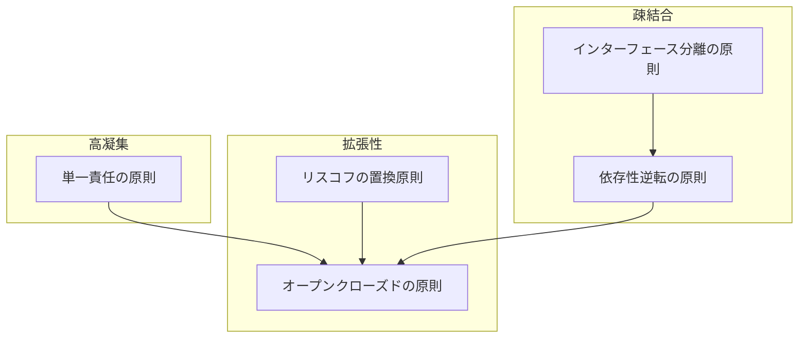

# SOLID原則とは

SOLID原則は、保守性・拡張性・再利用性の高いソフトウェアを構築するための設計指針であり、特にオブジェクト指向プログラミングにおいて重要です。  
これらの原則は、開発後の変更要求に柔軟に対応できる「良い設計」を支えるものです。  
2000年代にRobert C. Martin氏によって提唱されました。

| 頭文字 | 原則 | 説明 | 得られるメリット | チェックポイント例 |
|--------|------|------|------------------|--------------------|
| **S** | [単一責任の原則](single-responsibility-principle.md) | クラスは「たった一人のアクター」に対して責任を持つべき | 変更理由が明確になり、修正や拡張がしやすくなる | - クラスは1つの理由でしか変更されないか - 責務が混在していないか |
| **O** | [オープンクローズドの原則](open-closed-principle.md) | 拡張に開かれ、修正に閉じているべき | 既存コードを壊さずに新しい振る舞いを追加できる | - 新しい機能追加の際に既存クラスを修正していないか - ポリモーフィズムや拡張ポイントを活用しているか |
| **L** | [リスコフの置換原則](liskov-substitution-principle.md) | サブタイプはスーパータイプと置換可能でなければならない | 継承関係の一貫性を保ち、安全な拡張が可能になる | - 派生クラスを使ってもクライアントの挙動が破綻しないか - 置き換えた際に予期せぬエラーが出ないか |
| **I** | [インターフェース分離の原則](interface-segregation-principle.md) | クライアントにとって不要なメソッドへの依存を強制しない | 小さなインターフェースを提供し、結合度を下げる | - インターフェースが肥大化していないか - クライアントが使わないメソッドに依存していないか |
| **D** | [依存性逆転の原則](dependency-inversion-principle.md) | 上位モジュールと下位モジュールは抽象に依存すべき | 実装に依存せず、モジュール間の独立性が高まる | - 実装ではなく抽象に依存しているか - 上位モジュールが下位モジュールに直接依存していないか |

## なぜSOLIDが必要なのか？

現代のソフトウェア開発では、リリース後の機能追加・修正・保守が避けられません。  
SOLID原則は、そのような変化に柔軟に対応できる設計を実現するために重要な指針です。

## SOLID原則を適用するメリット

SOLID原則を適用することで、以下のような問題を解決できます。

### 👎 非SOLIDなコードの問題点
- ちょっとした修正が、意図しない別の場所に影響してバグが発生する
- 簡単な機能追加のはずなのに、多くの既存コードを変更する必要がある
- コードの構造が複雑で、全体を理解するのに時間がかかる
- 再利用しづらく、似たような処理を何度も書いてしまう
- モジュール同士の結びつきが強く、テストがしにくい

### 👍 SOLIDなコードのメリット
- 拡張性が高く、新機能の追加が容易
- 変更の影響範囲が局所的で、予測しやすい
- モジュール単位でのテストが容易
- コードの再利用性が高く、保守性が向上
- チーム開発での理解・共有がしやすい

## SOLID原則間の関連性

各原則は独立していますが、相互に関連し合っています。

- **単一責任の原則**を守ることで、一つのクラスが複数の役割を持たなくなり、**オープンクローズドの原則**の適用が容易になります
- **リスコフの置換原則**は**オープンクローズドの原則**を支え、拡張性の高いコードを実現します
- **インターフェース分離の原則**と**依存性逆転の原則**は互いに補完し合い、疎結合なモジュール設計を促進します

### SOLID原則の関連性

## 学習を深めるためのリソース

- [Clean Architecture: A Craftsman's Guide to Software Structure and Design](https://www.amazon.co.jp/dp/0134494164) - Robert C. Martin著
- [Agile Software Development, Principles, Patterns, and Practices](https://www.amazon.co.jp/dp/0135974445) - Robert C. Martin著
- [The Principles of OOD](http://butunclebob.com/ArticleS.UncleBob.PrinciplesOfOod) - Robert C. Martin公式サイト
- [TypeScriptで学ぶSOLID原則（Qiita）](https://qiita.com/KouMatsu/items/ca4e26336cc04fbc93d8)
- [SOLID Principles with TypeScript（dev.to）](https://dev.to/harshaash/solid-principles-with-typescript-1kfc)
- [Refactoring.Guru: SOLID](https://refactoring.guru/design-patterns/solid)