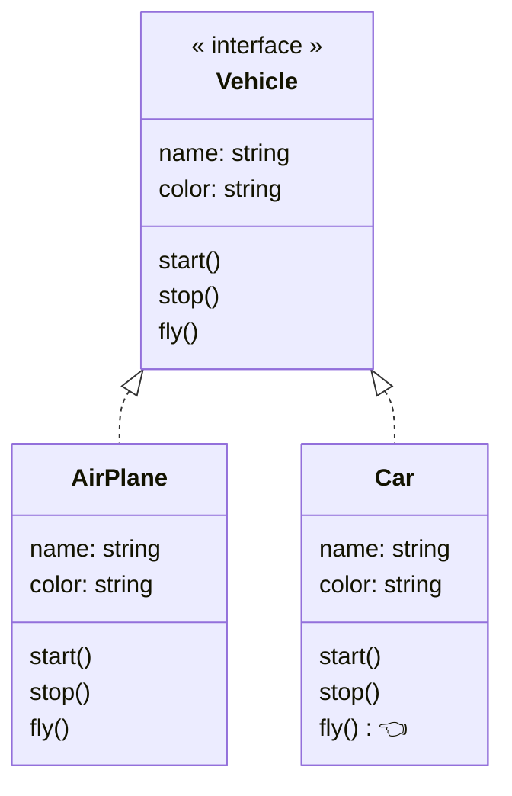
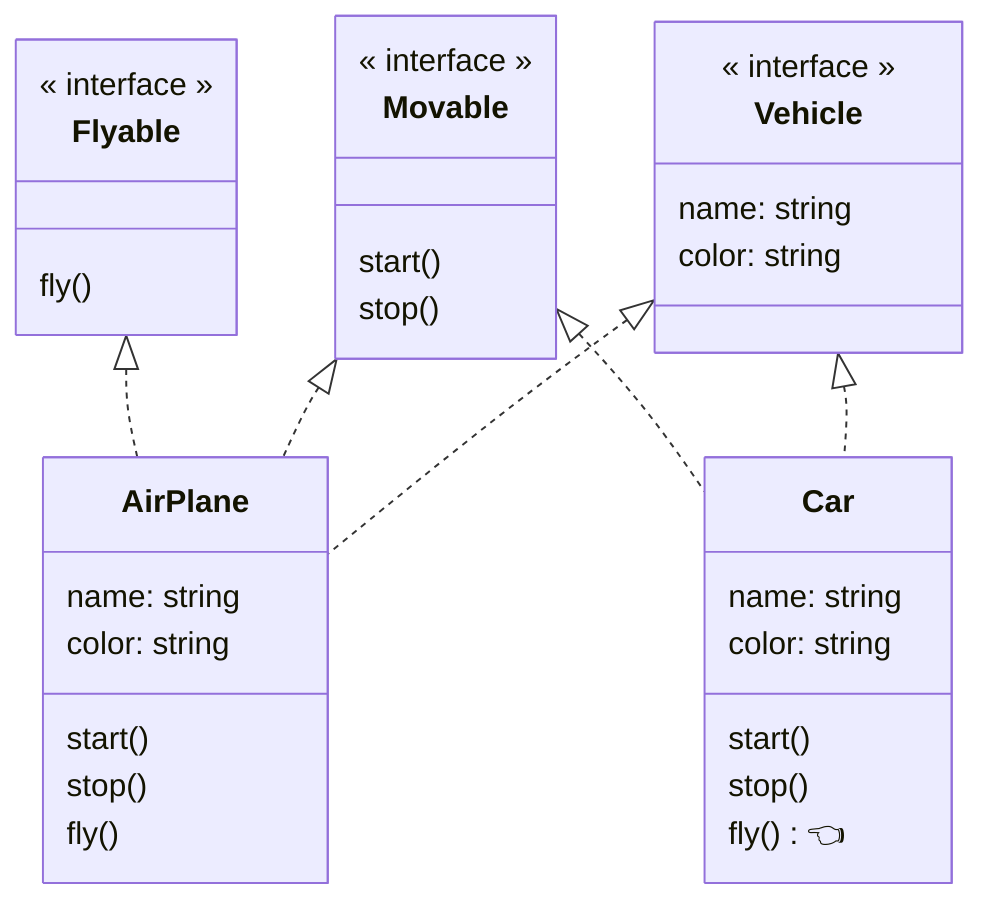

# インターフェース分離の原則

## インターフェース分離の原則とは

**インターフェースのクライアントにとって利用しないフィールドやメソッドへの依存を矯正してはならない。**

インターフェースや抽象クラスの抽象メソッドは未実装のままではエラーとなり、サブクラスでの実装を強制することができる。
だが、実装クラスに関係ないメソッドがあったしても実装しなければいけない。

➡️ インターフェースに用意されている**不必要なフィールドやメソッドにクライアントが依存しなくてもいいようにインターフェースは適切に分割すべき**

## インターフェース分離の原則に違反した例



## インターフェース分離に違反するとどうなるのか
- インターフェースに変更があると、実装側で使っていないメソッドである場合も修正しなければならなくなる
- 不要なメソッドを使わない（退化させる）ことで、リスコフの置換原則に違反する
- インターフェースが複数のアクターに使われる場合、単一責任の原則に違反する


## 解決策
役割ごとにインターフェースを分割する




## TypeScript

### 違反例


```ts
interface Vehicle {
  name: string;
  color: string;
  start(): void;
  stop(): void;
  fly(): void;
}

class AirPlane implements Vehicle {
  constructor(public name: string, public color: string) {}
  start() {
    console.log('start');
  }
  stop() {
    console.log('stop');
  }
  fly() {
    console.log('fly');
  }
}

class Car implements Vehicle {
  constructor(public name: string, public color: string) {}
  start() {
    console.log('start');
  }
  stop() {
    console.log('stop');
  }
  fly() {
    throw new Error('Car is not fly()');
  }
}

const run = () => {
  const airPlane: Vehicle = new AirPlane('a1', 'silver');
  airPlane.start();
  airPlane.fly();
  airPlane.stop();

  const car: Vehicle = new Car('c1', 'white');
  car.start();
  car.fly();
};

run();
```

##### 実行結果
```
start
fly
stop
start
```

### 解決策


```ts
interface Vehicle {
  name: string;
  color: string;
}
interface Movable {
  start();
  stop();
}
interface Flyable {
  fly();
}

class AirPlane implements Vehicle, Movable, Flyable {
  constructor(public name: string, public color: string) {}
  start() {
    console.log('start');
  }
  stop() {
    console.log('stop');
  }
  fly() {
    console.log('fly');
  }
}

class Car implements Vehicle, Movable {
  constructor(public name: string, public color: string) {}
  start() {
    console.log('start');
  }
  stop() {
    console.log('stop');
  }
}

const run = () => {
  const airPlane = new AirPlane('a1', 'silver');
  airPlane.start();
  airPlane.fly();
  airPlane.stop();

  const car = new Car('c1', 'white');
  car.start();
  car.stop();
};

run();

```

##### 実行結果

```
start
fly
stop
start
stop
```