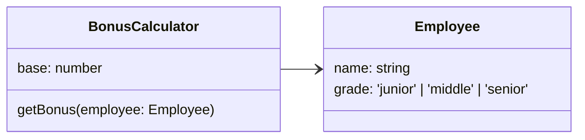
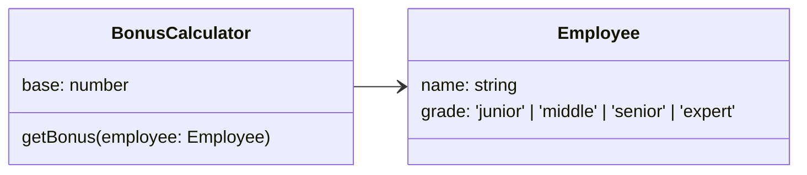
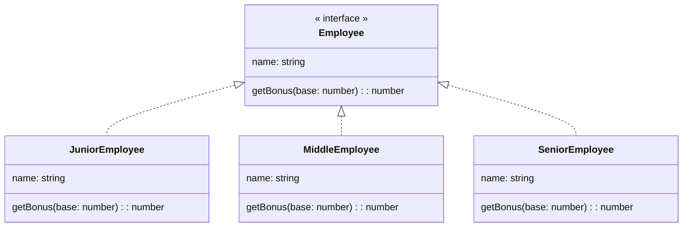
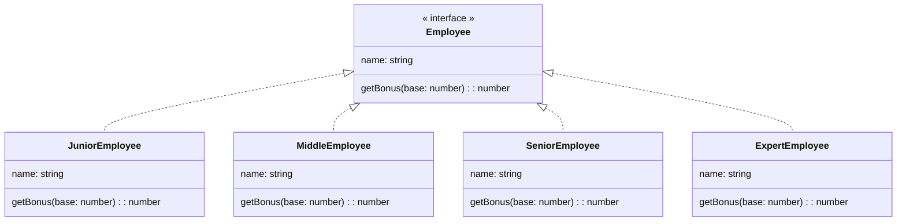

# オープンクローズドの原則

## オープンクローズドの原則とは
ソフトウェアの構成要素は**拡張に対して開かれて**いて、**修正に対して閉じて**いないければいけない。

1. 拡張に対して開かれている:  
新たなコードを追加することで、機能を拡張することができる
2. 修正に対して閉じている:  
拡張によって既存のコードが修正されない

➡️ **ソフトウェアの振る舞いは既存の成果物を変更せずに拡張できるようにすべき**

## オープン・クローズドの原則を適用すべきケース
- **種別によって振る舞いの変更が必要な場合**
   - 会員ランク
      - Bronseならポイント1倍
      - Silverならポイント2倍
      - Goldならポイント3倍
   - データの保存先の種類
      - RDB
      - NoSQL
      - CSV File

➡️ **種別の拡張があった場合でも、既存のコード変更することなく対応可能**


## オープンクローズドの原則に違反した例



```ts
getBonus(employee: Employee): number {
  if (employee.grade === 'junior') {
    return Math.floor(this.base * 1.1);
  } else if (employee.grade === 'middle') 
    return Math.floor(this.base * 1.5);{
  } else {
    return Math.floor(this.base * 2);
  }
}
```


### 仕様変更
`grade`に新しく`expert`を追加した場合



```ts
getBonus(employee: Employee): number {
  if (employee.grade === 'junior') {
    return Math.floor(this.base * 1.1);
  } else if (employee.grade === 'middle') 
    return Math.floor(this.base * 1.5);{
  } else if (employee.grade === 'senior') 
    return Math.floor(this.base * 2);
  } else {
    return Math.floor(this.base * 3);
  }
}
```

## 原則に違反するとどうなるか

- 既存のコードに修正を加えると、バグを生んでしまう可能性がある  
軽微な修正であっても、ケアレスミスをする可能性がある
- 既存のコードに対して再テストを行う工数がかかる  
機能が増えてくるとテストの工数も増えていく

## 解決策

拡張の可能性があるのものを抽象化し、具体の種別は抽象を実装する



### 仕様変更後
新たに`ExpertEmployee`が追加されていても、既存の`Employee`には影響しない。



----

## TypeScript

### 違反例

#### 仕様変更前
```ts
type Grade = 'junior' | 'middle' | 'senior';

class Employee {
  constructor(public namme: string, public grade: Grade) {}
}

class BonusCalculator {
  constructor(public base: number) {}

  getBonus(employee: Employee): number {
    if (employee.grade === 'junior') {
      return Math.floor(this.base * 1.1);
    } else if (employee.grade === 'middle') {
      return Math.floor(this.base * 1.5);
    } else {
      return Math.floor(this.base * 2);
    }
  }
}

const run = () => {
  const emp1 = new Employee('Yamada', 'junior');
  const emp2 = new Employee('Suzuki', 'middle');
  const emp3 = new Employee('Tanaka', 'senior');

  const bonusCalculator = new BonusCalculator(1000);

  console.log(bonusCalculator.getBonus(emp1));
  console.log(bonusCalculator.getBonus(emp2));
  console.log(bonusCalculator.getBonus(emp3));
};

run();

```

##### 実行結果

```
1100
1500
2000
```

#### 仕様変更後

```ts
type Grade = 'junior' | 'middle' | 'senior' | 'expert';

class Employee {
  constructor(public namme: string, public grade: Grade) {}
}

class BonusCalculator {
  constructor(public base: number) {}

  getBonus(employee: Employee): number {
    if (employee.grade === 'junior') {
      return Math.floor(this.base * 1.1);
    } else if (employee.grade === 'middle') {
      return Math.floor(this.base * 1.5);
    } else if (employee.grade === 'senior') { 👈 // すでに安定稼働している`getBonus()`メソッドを改変する必要が出てくる
      return Math.floor(this.base * 2);
    } else {
      return Math.floor(this.base * 3); 👈
    }
  }
}

const run = () => {
  const emp1 = new Employee('Yamada', 'junior');
  const emp2 = new Employee('Suzuki', 'middle');
  const emp3 = new Employee('Tanaka', 'senior');
  const emp4 = new Employee('Sato', 'expert');

  const bonusCalculator = new BonusCalculator(1000);

  console.log(bonusCalculator.getBonus(emp1));
  console.log(bonusCalculator.getBonus(emp2));
  console.log(bonusCalculator.getBonus(emp3));
  console.log(bonusCalculator.getBonus(emp4));
};

run();

```

##### 実行結果

```
1100
1500
2000
3000
```

### 解決策

#### 仕様変更前
```ts
iinterface IEmployee {
  name: string;
  getBonus(base: number): number;
}

class JuniorEmployee implements IEmployee {
  constructor(public name: string) {}
  getBonus(base: number): number {
    return Math.floor(base * 1.1);
  }
}

class MiddleEmployee implements IEmployee {
  constructor(public name: string) {}
  getBonus(base: number): number {
    return Math.floor(base * 1.5);
  }
}

class SeniorEmployee implements IEmployee {
  constructor(public name: string) {}
  getBonus(base: number): number {
    return Math.floor(base * 2);
  }
}

const run = () => {
  const emp1 = new JuniorEmployee('Yamada');
  const emp2 = new MiddleEmployee('Suzuki');
  const emp3 = new SeniorEmployee('Tanaka');

  const base = 1000;
  console.log(`${emp1.name}のボーナスは${emp1.getBonus(base)}`);
  console.log(`${emp2.name}のボーナスは${emp2.getBonus(base)}`);
  console.log(`${emp3.name}のボーナスは${emp3.getBonus(base)}`);
};

run();

```

##### 実行結果
```
Yamadaのボーナスは1100
Suzukiのボーナスは1500
Tanakaのボーナスは2000
```

#### 仕様変更後
```ts
interface IEmployee {
  name: string;
  getBonus(base: number): number;
}

class JuniorEmployee implements IEmployee {
  constructor(public name: string) {}
  getBonus(base: number): number {
    return Math.floor(base * 1.1);
  }
}

class MiddleEmployee implements IEmployee {
  constructor(public name: string) {}
  getBonus(base: number): number {
    return Math.floor(base * 1.5);
  }
}

class SeniorEmployee implements IEmployee {
  constructor(public name: string) {}
  getBonus(base: number): number {
    return Math.floor(base * 2);
  }
}

class ExpertEmployee implements IEmployee {
  constructor(public name: string) {}
  getBonus(base: number): number {
    return Math.floor(base * 3);
  }
}

const run = () => {
  const emp1 = new JuniorEmployee('Yamada');
  const emp2 = new MiddleEmployee('Suzuki');
  const emp3 = new SeniorEmployee('Tanaka');
  const emp4 = new ExpertEmployee('Sato'); // 追加した機能以外の既存機能には何も修正を加えていない

  const base = 1000;
  console.log(`${emp1.name}のボーナスは${emp1.getBonus(base)}`);
  console.log(`${emp2.name}のボーナスは${emp2.getBonus(base)}`);
  console.log(`${emp3.name}のボーナスは${emp3.getBonus(base)}`);
  console.log(`${emp4.name}のボーナスは${emp4.getBonus(base)}`);
};

run();

```

##### 実行結果
```
Yamadaのボーナスは1100
Suzukiのボーナスは1500
Tanakaのボーナスは2000
Satoのボーナスは3000

```

