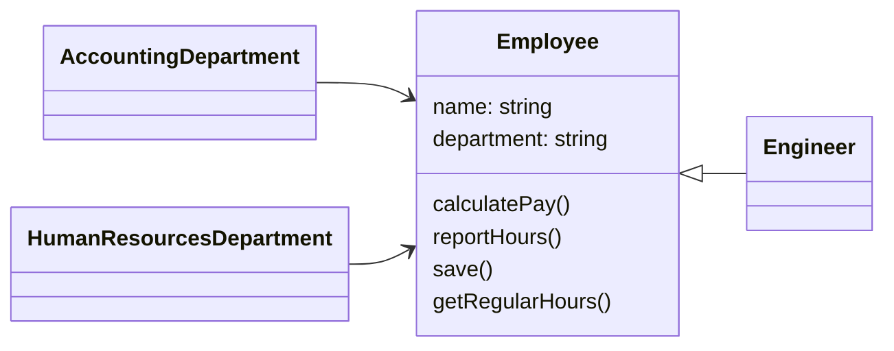
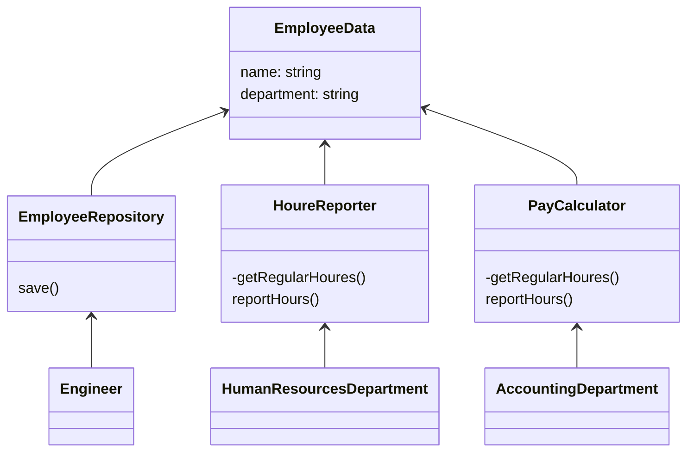

# 単一責任の原則

## 単一責任の原則とは
クラスは「たったひとつのアクターに対して責務を負う」べきである。  
**アクターが異なるクラスは、アクター毎に分割するべきです。**

※ `アクター`: そのクラスを使用するユーザーやステークスホルダー

## 単一原則に違反した例



### 仕様変更

1. 経理部門（AccountingDepartment）からの依頼で`getRreqularHours()`の変更を行った。
2. 変更後にテストし、経理部門にも確認しもらいリリース
3. 人事部門から「レポート結果が間違っていると」クレームが入る。


### 原因
経理部門と人事部門と異なるのに同一のメソッドにて労働時間取得していた為、人事部門では修正する必要がなかったのに、経理部門の修正が人事部門の利用にも影響した。

## 原則に違反するとどうなるのか
- あるアクターのために行なった変更の影響が別のアクターにも及び、バグが生まれてしまう可能性がある。
- 変更前にどのアクターに影響があるかを調査する工数がかかる。
- 変更後に全てのアクターに対してバクが発生していないかのテストを行う工数がかかる
- コードの共通部分を同時に変更してしまい、コンフリクトする可能性がある。


## 解決策



## 補足

### DRYの原則との関係
Don"t Repeat Yourselfの原則とは、コードの繰り返しを避けろという内容の原則。  
ただし、同じようなロジックであっても、概念が違うものはDRYにすべきではない。

ビジネスを理解し、概念を理解できていないと単一責任の原則を完全に満たすことは難しい。

----

## TypeScript
### 違反例
#### 仕様変更前
```ts
class Employee {
  constructor(public name: string, public department: string) {}

  // 経理部門がアウター
  calculatoPay() {
    this.getRegularHoures();
    console.log(`${this.name}の給与を計算しました。`);
  }

  // 人事部門がアクター
  reportHours() {
    this.getRegularHoures();
    console.log(`${this.name}の労働時間をレポートしました。`);
  }

  // データベースの管理者がアクター
  save() {
    console.log(`${this.name}を保存しました。`);
  }

  private getRegularHoures() {
    // 仕様変更前
    console.log('経理部門・人事部門共通ロジック');
    // 仕様変更後
    // console.log('経理部門の仕様変更済み。');
  }
}

const run = () => {
  const emp = new Employee('山田', '開発');

  console.log('');
  console.log('経理部門');
  emp.calculatoPay();

  console.log('');
  console.log('人事部門');
  emp.reportHours();
};

run();
```
##### 実行結果（変更前）
```

経理部門
経理部門・人事部門共通ロジック
山田の給与を計算しました。

人事部門
経理部門・人事部門共通ロジック
山田の労働時間をレポートしました。
```
##### 実行結果（変更後）
```

経理部門
経理部門の仕様変更済み。
山田の給与を計算しました。

人事部門
経理部門の仕様変更済み。 👈 ここが間違っている
山田の労働時間をレポートしました。
```

### 解決策

#### 仕様変更前
```ts
class EmployeeData {
  constructor(public name: string, public department: string) {}
}

class EmployeeRepository {
  constructor(private employeeData: EmployeeData) {}
  // データベースの管理者がアクター
  save() {
    console.log(`${this.employeeData.name}を保存しました。`);
  }
}

class HoureReporter {
  private getRegularHours() {
    console.log('労働時間レポート専用の労働時間計算ロジック');
  }
  reportHours(employeeData: EmployeeData) {
    console.log(`${employeeData.name}の労働時間をレポートしましした。`);
  }
}
class PayCalculator {
  private getRegularHours() {
    console.log('給与計算用の労働時間計算ロジック');
  }
  calculatePay(employeeData: EmployeeData) {
    this.getRegularHours();
    console.log(`${employeeData.name}の給与を計算しました。`);
  }
}

const run = () => {
  const employeeData = new EmployeeData('鈴木', '開発');
  const payCalculator = new PayCalculator();
  const hourReporter = new HoureReporter();

  console.log('経理部門');
  payCalculator.calculatePay(employeeData);
  console.log('');
  console.log('人事部門');
  hourReporter.reportHours(employeeData);
};

run();

```

##### 実行結果
```
経理部門
給与計算用の労働時間計算ロジック
鈴木の給与を計算しました。

人事部門
鈴木の労働時間をレポートしましした。。
```
