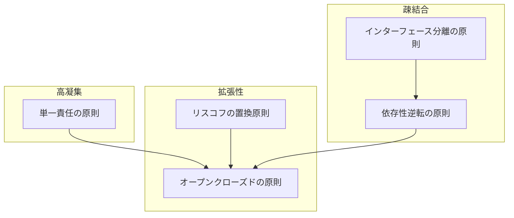

# SOLID原則とは

SOLID原則は、ソフトウェアを構築する際に守るべき5つの基本原則です。  
オブジェクト指向プログラミングにおいて、「変更しやすく」「理解しやすく」「再利用しやすい」モジュールを設計・開発するための指針となります。  
2000年代にRobert C. Martin氏によって提唱されました。

|頭文字|原則|説明|
|---|---|---|
|S|[**S**ingle Responsibility Principle  (単一責任の原則)](single-responsibility-principle.md)|クラスは「たった一人のアクター」に対して責任を持つべき|
|O|[**O**pen Closed Principle  (オープンクローズドの原則)](open-closed-principle.md)|ソフトウェアの構成要素は「拡張に開かれ」「修正に閉じられている」べき|
|L|[**L**iskov Substitution Principle  (リスコフの置換原則)](liskov-substitution-principle.md)|サブタイプは、そのスーパータイプと置換可能でなければならない|
|I|[**I**nterface Segregation Principle  (インターフェース分離の原則)](interface-segregation-principle.md)|インターフェースのクライアントにとって利用しないメソッドへの依存を強制してはならない|
|D|[**D**ependency Inversion Principle  (依存性逆転の原則)](dependency-inversion-principle.md)|上位モジュールは下位モジュールに依存せず、両者は抽象に依存すべき|

## SOLID原則を適用するメリット

SOLID原則を適用することで、以下のような問題を解決できます。

### 👎 非SOLIDなコードの問題点
- ちょっとした修正が、意図しない別の場所に影響してバグが発生する
- 簡単な機能追加のはずなのに、多くの既存コードを変更する必要がある
- コードの構造が複雑で、全体を理解するのに時間がかかる
- 再利用しづらく、似たような処理を何度も書いてしまう
- モジュール同士の結びつきが強く、テストがしにくい

### 👍 SOLIDなコードのメリット
- 拡張性が高く、新機能の追加が容易
- 変更の影響範囲が局所的で、予測しやすい
- モジュール単位でのテストが容易
- コードの再利用性が高く、保守性が向上
- チーム開発での理解・共有がしやすい

## SOLID原則間の関連性

各原則は独立していますが、相互に関連し合っています。

- **単一責任の原則**を守ることで、一つのクラスが複数の役割を持たなくなり、**オープンクローズドの原則**の適用が容易になります
- **リスコフの置換原則**は**オープンクローズドの原則**を支え、拡張性の高いコードを実現します
- **インターフェース分離の原則**と**依存性逆転の原則**は互いに補完し合い、疎結合なモジュール設計を促進します

### SOLID原則の関連性

## 学習を深めるためのリソース

- [Clean Architecture: A Craftsman's Guide to Software Structure and Design](https://www.amazon.co.jp/dp/0134494164) - Robert C. Martin著
- [Agile Software Development, Principles, Patterns, and Practices](https://www.amazon.co.jp/dp/0135974445) - Robert C. Martin著
- [The Principles of OOD](http://butunclebob.com/ArticleS.UncleBob.PrinciplesOfOod) - Robert C. Martin公式サイト